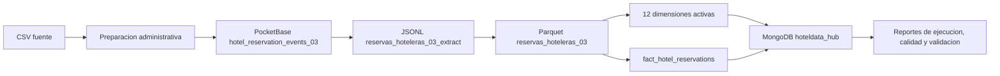

# Diseño GA03 - HotelData Reservas

## Visión

HotelData Hub Analytics se proyecta como plataforma web/responsiva de reservas hoteleras inspirada en Expedia/Trivago.

GA03 representa una fase documental y funcional centrada en datos, analítica, CRUD analítico, auditoría y ETL. No implementa todavía el marketplace completo, login real, pagos, PMS, tarifas operativas ni partner central.

## Configuración real

| Elemento | Valor |
| --- | --- |
| Tarea | `TASK_NUMBER=03` |
| Registros objetivo | `TARGET_RECORDS=300000` |
| PocketBase | `hotel_reservation_events_03` |
| MongoDB | `hoteldata_hub` |
| DAG | `hoteldata_reservas_03_pipeline` |
| Hecho principal | `fact_hotel_reservations` |
| Dimensiones activas | 12 |
| JSONL | `data/staging/reservas_hoteleras_03_extract.jsonl` |
| Parquet | `data/processed/reservas_hoteleras_03.parquet` |
| Reportes | `data/reports/reporte_ejecucion_reservas_03.json`, `data/reports/reporte_calidad_reservas_03.json`, `data/reports/validacion_dataset_reservas_03.json` |

## Flujo de datos

CSV -> PocketBase es preparación administrativa de fuente. PocketBase -> JSONL -> Parquet -> MongoDB es el ETL principal.

## Modelo actual implementado

### Hechos

- `fact_hotel_reservations`
- `fact_hotel_events`

### 12 dimensiones activas

- `dim_hotels`
- `dim_destinations`
- `dim_visitor_countries`
- `dim_sites`
- `dim_dates`
- `dim_promotions`
- `dim_click_status`
- `dim_reservation_status`
- `dim_occupancy_profile`
- `dim_stay_length_category`
- `dim_booking_window_category`
- `dim_price_category`

### Control

- `etl_executions`
- `data_quality_reports`
- `rejected_records`

### Documental/operativo actual

- `hotels`
- `locations`
- `contacts`
- `websites`
- `facilities`
- `attractions`
- `hotel_quality`
- `dataset_container`
- `system_catalogs`
- `search_logs`

### Legado

- `dim_countries`
- `dim_date`

## Modelo futuro planificado

El modelo futuro se documenta, pero no se implementa como parte obligatoria de GA03.

Incluye seguridad, usuario, sesiones, roles, permisos, perfiles de viajero, partner central, habitaciones, inventario, disponibilidad, tarifas, promociones, reservas, pagos, PMS, webhooks, Redis, configuraciones y estado de servicios Docker.

Las colecciones futuras se detallan en `docs/ga03/modelo_futuro_ga03.md` y `docs/ga03/diseno_base_datos_ga03.md`.

## Casos de uso

El diagrama de casos de uso debe tener exactamente 32 CU agrupados en 8 paquetes:

1. Experiencia del cliente y búsqueda hotelera.
2. Cuenta, sesión y perfil de usuario.
3. Core de reservas hoteleras.
4. Gestión hotelera / Partner Central.
5. Habitaciones, inventario y disponibilidad.
6. Tarifas, promociones y revenue.
7. Analytics, BI y toma de decisiones.
8. Administración, datos, ETL y gobierno.

Los actores humanos principales son:

- Usuario operativo.
- Administrador.

PocketBase y MongoDB pueden aparecer como sistemas técnicos externos, no como actores humanos.

## Estados por CU

- Implementado: CU25, CU29, CU30, CU32.
- Parcial: CU01, CU02, CU03, CU04, CU12, CU24, CU26, CU27, CU28.
- Planificado: CU05, CU06, CU07, CU08, CU09, CU10, CU11, CU13, CU14, CU15, CU16, CU17, CU18, CU19, CU20, CU21, CU22, CU23, CU31.

## Diseño de `/etl-status`

La sección `/etl-status` se reutiliza y amplía para GA03:

- GA03 aparece primero.
- TAF01 queda como flujo histórico colapsado.
- TA02 queda como evidencia histórica colapsada.
- Se separa preparación administrativa de fuente y ETL principal.
- Se muestran estados de PocketBase, MongoDB, colección, conteo objetivo, reportes y avance.
- JSON técnico queda en desplegables.
- Los errores de fuente no disponible se muestran con mensajes controlados.

## Docker y Redis

Docker y Redis quedan como preparación futura:

- `docker-compose.yml` documenta `mongo`, `redis`, `pocketbase` y `app`.
- `docker-compose.airflow.yml` es opcional.
- Redis queda previsto para cache de dashboard, búsquedas frecuentes, sesiones futuras, estado temporal de jobs y rate limiting futuro.
- Redis no se acopla al ETL actual.

## Evidencia documental

Los documentos principales quedan en:

- `docs/ga03/casos_uso_ga03.md`
- `docs/ga03/diagrama_casos_uso_ga03.md`
- `docs/ga03/diseno_base_datos_ga03.md`
- `docs/ga03/modelo_futuro_ga03.md`
- `docs/ga03/docker_redis_plan.md`
- `diagrams/ga03_use_cases.puml`
- `diagrams/ga03_database.puml`
