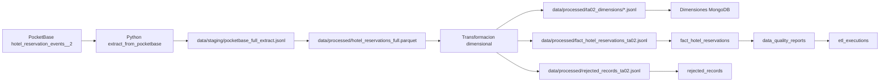

# Diseno TA02 - HotelData Reservations

## Overview

TA02 extiende HotelData Hub Analytics agregando capacidades analiticas de reservas hoteleras. Implementa un flujo ETL completo desde PocketBase hacia MongoDB usando formato Parquet intermedio y modelo dimensional estrella.

**Metricas clave implementadas:**
- 201,000 registros de hechos procesados
- 12 dimensiones analiticas
- 0 registros rechazados
- Pipeline Airflow con 12 tareas orquestadas
- CRUD completo para hecho y dimensiones

## Architecture

### Estado real consolidado TAF01 + TA02

TA02 es una extension de HotelData Hub Analytics. Conserva la arquitectura TAF01 y agrega un flujo analitico de reservas desde PocketBase hacia MongoDB.

TAF01 queda como base historica CSV. TA02 reemplaza el foco funcional principal hacia reservas hoteleras, pero no elimina la arquitectura ni las reglas de separacion ya implementadas.

### Componentes principales

#### 1. Capa de origen: PocketBase
- **Proposito**: Fuente operacional de eventos de busqueda y reserva hotelera
- **Coleccion**: `hotel_reservation_events__2`
- **Configuracion**:
  - URL base: `POCKETBASE_URL` (default: `http://127.0.0.1:8090`)
  - Autenticacion: Admin email/password o token Bearer
  - Paginacion: 500 registros por pagina
- **Volumen**: 201,000 registros extraidos

#### 2. Capa ETL: Python
Modulos especializados para cada fase del pipeline:

- **`ta02_airflow_tasks.py`**: Orquestacion y coordinacion de tareas
  - Gestion de estado de ejecucion
  - Extraccion desde PocketBase con paginacion
  - Conversion JSONL → Parquet
  - Coordinacion de carga a MongoDB
  
- **`ta02_fact.py`**: Transformacion del hecho
  - Limpieza y validacion de tipos
  - Calculo de metricas derivadas (`reservas_brutas_usd`)
  - Generacion de claves dimensionales
  - Categorizacion de precio, estancia y anticipacion
  
- **`ta02_dimensions.py`**: Construccion dimensional
  - Dimensiones estaticas (categorias predefinidas)
  - Dimensiones dinamicas (extraidas de hechos)
  - Deduplicacion por clave primaria
  
- **`ta02_load_mongodb.py`**: Persistencia en MongoDB
  - Upsert de dimensiones por clave
  - Carga de hechos (insert o upsert segun configuracion)
  - Creacion de indices
  - Registro de auditoria

## Components and Interfaces

### Capa de orquestacion: Apache Airflow
- **DAG**: `hoteldata_ta02_reservations_pipeline`
- **Tareas**: 12 operadores Python secuenciales
- **Restricciones arquitectonicas**:
  - Solo `PythonOperator` (no `BashOperator` para datos)
  - No importa `src.app` (separacion de capas)
- **Flujo de tareas**:
  1. `validate_environment` - Preparacion de directorios y estado
  2. `extract_from_pocketbase` - Planificacion de extraccion
  3. `save_pocketbase_extract` - Descarga paginada a JSONL
  4. `convert_to_parquet` - Conversion a formato columnar
  5. `validate_parquet_schema` - Validacion de columnas requeridas
  6. `transform_dimensions` - Construccion de dimensiones
  7. `transform_fact_reservations` - Transformacion del hecho
  8. `load_dimensions_to_mongodb` - Carga dimensional
  9. `load_fact_to_mongodb` - Carga del hecho
  10. `create_indexes` - Optimizacion de consultas
  11. `run_quality_checks` - Validacion de calidad
  12. `save_execution_report` - Auditoria final

#### Capa de persistencia: MongoDB
- **Base de datos**: `hoteldata_hub`
- **Colecciones analiticas**:
  - `fact_hotel_reservations` (201,000 documentos)
  - 12 colecciones dimensionales (ver seccion Modelo Dimensional)
- **Colecciones de control**:
  - `rejected_records` - Registros con errores de validacion
  - `etl_executions` - Historial de ejecuciones ETL
  - `data_quality_reports` - Metricas de calidad por ejecucion
- **Indices**: Claves primarias, claves foraneas, campos de auditoria

#### Capa de presentacion: FastAPI
- **Rutas web**:
  - `/ta02` - Dashboard principal TA02
  - `/ta02/crud` - Indice de colecciones CRUD
  - `/ta02/crud/{collection_name}` - Listado paginado (max 25 docs/pagina)
  - `/ta02/crud/{collection_name}/new` - Formulario de creacion
  - `/ta02/crud/{collection_name}/{document_id}` - Detalle de documento
  - `/ta02/crud/{collection_name}/{document_id}/edit` - Formulario de edicion
  - `/ta02/crud/{collection_name}/{document_id}/delete` - Eliminacion
  
- **API REST**:
  - `GET /api/{collection_name}` - Listar con paginacion
  - `POST /api/{collection_name}` - Crear documento
  - `GET /api/{collection_name}/{document_id}` - Obtener documento
  - `PUT /api/{collection_name}/{document_id}` - Actualizar documento
  - `DELETE /api/{collection_name}/{document_id}` - Eliminar documento
  - `GET /api/{collection_name}/search` - Busqueda con filtros

## Data Models

### Modelo dimensional implementado



## Modelo dimensional implementado

Hecho:
- `fact_hotel_reservations`

Dimensiones:
- `dim_hotels`
- `dim_destinations`
- `dim_visitor_countries`
- `dim_sites`
- `dim_dates`
- `dim_promotions`
- `dim_click_status`
- `dim_reservation_status`
- `dim_occupancy_profile`
- `dim_stay_length_category`
- `dim_booking_window_category`
- `dim_price_category`

## Campos principales del hecho

`fact_hotel_reservations` conserva identificadores, metricas, indicadores y llaves dimensionales:

- `source_record_id`, `srch_id`, `date_time`, `date_key`
- `site_id`, `visitor_location_country_id`, `prop_country_id`, `prop_id`
- `price_usd`, `promotion_flag`, `click_bool`, `reserva_bool`, `reservas_brutas_usd`
- `srch_destination_id`, `srch_length_of_stay`, `srch_booking_window`
- `srch_adults_count`, `srch_children_count`, `srch_room_count`
- `occupancy_profile_id`, `stay_length_category_id`, `booking_window_category_id`, `price_category_id`
- `loaded_at`, `execution_id`

## Matriz de impacto entre tareas

| ID | Elemento afectado | Tarea origen | Tipo de cambio | Estado anterior | Estado actual | Ruta/coleccion real | Accion SDD | Evidencia |
| --- | --- | --- | --- | --- | --- | --- | --- | --- |
| IMP-001 | Nombre del proyecto | TAF01 | Modificar | HotelData Hub | HotelData Hub Analytics | `.kiro/steering/project-context.md` | Alinear nombre completo | Steering |
| IMP-002 | Base MongoDB `hoteldata_hub` | TAF01 | Conservar | Base final TAF01 | Base final TAF01 + TA02 | MongoDB `hoteldata_hub` | Mantener | `config/settings.py` |
| IMP-003 | Flujo TAF01 CSV | TAF01 | Conservar | CSV -> MongoDB | Base historica | `data/raw/hotels.csv` | Documentar como historico | DAG TAF01 |
| IMP-004 | DAG TAF01 | TAF01 | Conservar | `hoteldata_taf01_etl_pipeline` | Implementado | `dags/hoteldata_taf01_etl_dag.py` | Mantener | DAG existente |
| IMP-005 | Flujo TA02 PocketBase-Parquet-MongoDB | TA02 | Agregar | No existia | Implementado | `src/etl/ta02_airflow_tasks.py` | Documentar flujo real | Reporte TA02 |
| IMP-006 | Coleccion PocketBase | TA02 | Agregar | No existia | `hotel_reservation_events__2` | PocketBase | Fijar nombre real | ETL TA02 |
| IMP-007 | Parquet TA02 | TA02 | Agregar | No existia | `hotel_reservations_full.parquet` | `data/processed/hotel_reservations_full.parquet` | Corregir ruta spec | Reporte calidad |
| IMP-008 | Hecho reservas | TA02 | Agregar | `fact_hotel_events` era foco TAF01 | `fact_hotel_reservations` es foco TA02 | MongoDB `fact_hotel_reservations` | Documentar hecho real | 201000 registros |
| IMP-009 | 12 dimensiones TA02 | TA02 | Agregar | Dimensiones TAF01 | 12 dimensiones de reservas | MongoDB y `data/processed/ta02_dimensions/*.jsonl` | Listar todas | Reporte TA02 |
| IMP-010 | CRUD TA02 | TA02 | Agregar | CRUD catalogos TAF01 | CRUD hecho/dimensiones TA02 | `/ta02/crud`, `/api/{collection_name}` | Documentar rutas | Reporte CRUD |
| IMP-011 | Reportes `etl_executions` | TAF01 | Ampliar | Auditoria TAF01 | Auditoria TAF01 + TA02 | MongoDB `etl_executions` | Mantener control | `ta02_execution_report.json` |
| IMP-012 | Reportes `data_quality_reports` | TAF01 | Ampliar | Calidad TAF01 | Calidad TAF01 + TA02 | MongoDB `data_quality_reports` | Mantener control | `ta02_quality_report.json` |
| IMP-013 | `rejected_records` | TAF01 | Ampliar | Rechazos TAF01 | Rechazos TA02 con 0 registros | MongoDB `rejected_records` | Documentar conteo real | Reporte TA02 |
| IMP-014 | Reglas Airflow sin BashOperator | TAF01 | Ampliar | Regla TAF01 | Regla comun TAF01 + TA02 | `dags/*.py` | Mantener restriccion | DAGs PythonOperator |

## Evidencia real

- `data/reports/ta02_execution_report.json`: ejecucion `success`, base `hoteldata_hub`, `201000` hechos finales, `0` rechazados.
- `data/reports/ta02_quality_report.json`: `source_rows` 201000, `valid_fact_records` 201000.
- `data/reports/ta02_crud_validation_report.json`: CRUD validado para hecho y dimensiones.

## Correctness Properties

### Invariantes de integridad

1. **Integridad referencial**: Toda clave foranea en `fact_hotel_reservations` debe existir en su dimension correspondiente.
2. **Completitud de hechos**: Todos los registros extraidos de PocketBase deben procesarse (aceptados o rechazados).
3. **Unicidad de dimensiones**: Cada dimension tiene una clave primaria unica.
4. **Auditoria completa**: Cada ejecucion ETL registra inicio, fin, cantidad procesada y estado.
5. **Consistencia temporal**: `date_key` debe ser valido y consistente con `date_time`.

### Propiedades de calidad

- Cero registros duplicados en dimensiones
- Cero valores NULL en claves primarias
- Cero registros rechazados en TA02 (201,000 procesados exitosamente)
- Indices creados en todas las claves foraneas

## Error Handling

### Estrategia de manejo de errores

1. **Validacion de esquema**: Si Parquet no tiene columnas requeridas, la tarea falla y registra el error.
2. **Validacion de tipos**: Campos numericos invalidos se rechazan y registran en `rejected_records`.
3. **Validacion referencial**: Claves foraneas invalidas se rechazan.
4. **Recuperacion**: Si una tarea falla, Airflow reintenta hasta 3 veces antes de marcar como fallida.
5. **Auditoria de fallos**: Todos los errores se registran en `etl_executions` con timestamp y descripcion.

### Colecciones de control

- `rejected_records`: Registros que no pasaron validacion
- `etl_executions`: Historial de ejecuciones con estado (success/failure)
- `data_quality_reports`: Metricas de calidad por ejecucion

## Testing Strategy

### Validaciones implementadas

1. **Extraccion**: Verificar que PocketBase devuelve datos y que se persisten en JSONL
2. **Conversion**: Validar que Parquet tiene esquema correcto y cantidad de registros
3. **Transformacion**: Verificar que dimensiones no tienen duplicados y hechos tienen claves validas
4. **Carga**: Confirmar que MongoDB recibe cantidad correcta de documentos
5. **Indices**: Validar que indices existen y son accesibles

### Criterios de aceptacion por fase

- **Extraccion**: 201,000 registros en JSONL
- **Parquet**: 201,000 registros con esquema valido
- **Dimensiones**: 12 colecciones sin duplicados
- **Hecho**: 201,000 documentos en MongoDB
- **Rechazados**: 0 registros
- **Reportes**: Archivos JSON generados exitosamente

## Reglas para futuras tareas

Toda nueva tarea debe declarar explicitamente que conserva, agrega, modifica, reemplaza y elimina. Tambien debe indicar archivo, coleccion, ruta o modulo afectado y evidencia de aceptacion.

```md
## Relacion con entregas anteriores

Esta tarea no crea un proyecto independiente. Extiende el proyecto HotelData Hub Analytics.

### Elementos que se conservan
- ...

### Elementos que se agregan
- ...

### Elementos que se modifican
- ...

### Elementos que se reemplazan
- ...

### Elementos que se eliminan
- ...

### Matriz de impacto

| ID | Elemento afectado | Tarea origen | Tipo de cambio | Archivo/ruta/coleccion | Estado anterior | Estado nuevo | Criterio de aceptacion |
| --- | --- | --- | --- | --- | --- | --- | --- |
| IMP-001 | ... | ... | ... | ... | ... | ... | ... |
```
