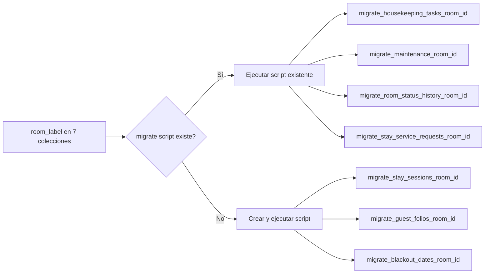

# Análisis: Campos Label vs Foreign Keys en MongoDB

> **Fecha:** 2026-07-23
> **Base de datos:** `hoteldata_hub`
> **Conexión:** `mongodb://localhost:27018`
> **Propósito:** Identificar campos que almacenan texto (labels) en lugar de referencias por ID (foreign keys) a otras colecciones.

---

## Resumen Ejecutivo

Se analizaron **~80 colecciones** del modelo operacional + analítico. Se identificaron **18 casos** donde campos almacenan strings descriptivos (labels) en lugar de ObjectId/ID referenciables. De estos:

| Gravedad | Cantidad | Descripción |
|----------|:--------:|-------------|
| 🚨 **Crítico** | 7 | Label sin FK — imposible relacionar con la colección destino |
| ⚠️ **Alto** | 8 | Label con colección destino existente pero sin relación formal |
| 🟡 **Medio** | 3 | Label redundante (tienen FK pero duplican label) |
| 🟢 **Bajo** | varias | Dimensiones analíticas (comportamiento esperado en star schema) |

---

## 🚨 CRÍTICO — Label sin FK (imposible relacionar)

Estas 7 colecciones usan `room_label` (string) para identificar una habitación, **sin ningún campo `room_id`** que referencie a `hotel_rooms._id`. Si el label cambia (ej: `"101"` → `"101A"`), **todas las referencias se rompen** y no hay forma de hacer join.

| # | Colección | Campo Label | Valores de ejemplo | Migración existente |
|---|-----------|-------------|--------------------|:-------------------:|
| 1 | `housekeeping_tasks` | `room_label` | `"111"`, `"110"`, `"101"`, `"100"` | ✅ `migrate_housekeeping_tasks_room_id.py` |
| 2 | `maintenance_tasks` | `room_label` | `"110"`, `"101"`, `"100"` | ✅ `migrate_maintenance_room_id.py` |
| 3 | `room_status_history` | `room_label` | `"101"`, `"100"`, `"110"`, `"111"` | ✅ `migrate_room_status_history_room_id.py` |
| 4 | `stay_service_requests` | `room_label` | `"HR-1-113"`, `"110"`, `"HR-1-111"`, `"HR-1-110"` | ✅ `migrate_stay_service_requests_room_id.py` |
| 5 | `stay_sessions` | `room_label` | `"110"`, `"HR-1-113"`, `"HR-1-110"`, `"HR-1-111"` | ❌ No existe |
| 6 | `guest_folios` | `room_label` | `"110"`, `"101"` | ❌ No existe |
| 7 | `blackout_dates` | `room_label` | `"100"` | ❌ No existe |

**Impacto:** 7 colecciones, ~130+ documentos que no se pueden relacionar con `hotel_rooms` por ID.

---

## ⚠️ ALTO — La colección destino EXISTE pero no se relaciona por ID

Estas colecciones almacenan un label string cuando la colección de referencia ya existe en la base de datos. El label es frágil y no garantiza integridad referencial.

| # | Colección | Campo Label | Valores de ejemplo | FK que debería tener | Colección destino |
|---|-----------|-------------|--------------------|---------------------|:-----------------:|
| 8 | `expense_invoices` | `category` | `"Articulos de baños"` | `category_id` → `expense_categories._id` | `expense_categories` (20 registros) |
| 9 | `employees` | `department` | `"Recepción"`, `"Administración"`, `"Mantenimiento"`, `"Limpieza"`, `"Revenue"` | `department_id` → `employee_departments._id` | `employee_departments` (5 registros) |
| 10 | `employees` | `position` | `"Gerente General"`, `"Recepcionista"`, `"Revenue Manager"`, `"Housekeeping Manager"`, `"Personal de Mantenimiento"` | `position_id` → catálogo de puestos | ❌ No existe |
| 11 | `navigation` | `required_permission` | Strings con nombre de permiso | `permission_id` → `permissions._id` | `permissions` (119 registros) |
| 12 | `users` | `primary_role` | `"admin"`, `"partner"`, etc. (9 valores únicos) | `role_id` → `roles._id` | `roles` (10 registros) |
| 13 | `users` | `role_ids` | JSON string `"[...]"` | Array de `ObjectId` → `roles._id` | `roles` (10 registros) |
| 14 | `booking_orders` | `coupon_code` | `"DESC10"` (código string) | `coupon_id` → `coupon_codes._id` | `coupon_codes` (16 registros) |
| 15 | `stay_service_requests` | `request_type_label` + `status_label` | `"Pendiente"`, `"Cancelado"`, `"Reserva en restaurante"`, etc. | Labels duplicados: usa código + texto | Los códigos están en `request_type` y `status` |

### Detalles importantes

**#9 — Inconsistencia entre `employees.department` y `employee_departments.name`:**

| `employees.department` | `employee_departments.name` |
|------------------------|---------------------------|
| Recepción | Recepción |
| Administración | Administración |
| Mantenimiento | Mantenimiento |
| Limpieza | **Housekeeping** ⚠️ |
| Revenue | Alimentos y Bebidas |

**Problema:** `"Limpieza"` no coincide con `"Housekeeping"`. No se puede hacer un match directo.

**#11 — `navigation.required_permission`:** Es un string que contiene el nombre del permiso. Si se renombra un permiso en `permissions`, todas las entradas de `navigation` quedan huérfanas.

**#12-13 — `users.primary_role` y `role_ids`:** Almacenan nombres de rol como string y un JSON como text respectivamente. No se puede consultar: `db.roles.find({_id: {$in: user.role_ids}})`. Ya existe una migración `migrate_role_permissions_embedded.py`.

**#15 — Labels duplicados en `stay_service_requests`:**
- `request_type` = `"wake_up_call"` + `request_type_label` = `"Despertador"`
- `status` = `"pending"` + `status_label` = `"Pendiente"`
- **Problema:** El label se puede derivar del código en el frontend. Almacenar ambos duplica datos y crea riesgo de inconsistencia.

---

## 🟡 MEDIO — Label redundante (tienen FK + label de copia)

Estas colecciones SÍ tienen la FK correcta, pero además almacenan el label denormalizado para evitar joins en queries de solo lectura. Es aceptable pero riesgoso.

| # | Colección | Campo Label | Tiene FK | Riesgo |
|---|-----------|-------------|:--------:|--------|
| 16 | `room_status_log` | `room_label` | ✅ `hotel_room_id` → `hotel_rooms._id` | Si `hotel_rooms.room_label` cambia, `room_status_log.room_label` queda desactualizado |
| 17 | `guest_folios` | `hotel_label` | ✅ `prop_id` → `dim_hotels.prop_id` | Si el nombre del hotel cambia, el label del folio queda viejo |
| 18 | `ledger_transactions` | `account_name` | ✅ `account_code` → `chart_of_accounts.account_code` | Si el nombre de cuenta cambia, el ledger histórico queda inconsistente |

**Recomendación:** Si se decide mantener estos labels denormalizados, implementar un trigger/sistema que los actualice cuando el valor fuente cambie.

---

## 🟢 BAJO — Dimensiones analíticas (comportamiento esperado)

En el modelo dimensional (star schema), las tablas de dimensión POR DISEÑO contienen labels descriptivos. Esto es correcto.

| Colección | Campos label | Propósito |
|-----------|-------------|-----------|
| `dim_hotels` | `hotel_label`, `display_name`, `hotel_name`, `description` | Nombre del hotel |
| `dim_destinations` | `destination_label`, `destination_display_name`, `destination_name` | Nombre del destino |
| `dim_visitor_countries` | `visitor_country_label`, `country_display_name`, `country_name` | Nombre del país |
| `dim_sites` | `site_label` | Nombre del sitio |
| `dim_occupancy_profile` | `occupancy_label` | Perfil de ocupación |
| `dim_promotions` | `promotion_label` | Nombre de promoción |
| `dim_price_category` | `price_category` | Categoría de precio |
| etc. | — | — |

Esto es correcto porque las dimensiones **son** las tablas de referencia.

---

## Estado de migraciones existentes

De los scripts de migración en `server/scripts/`:

| Script | Objetivo | Estado |
|--------|----------|:------:|
| `migrate_housekeeping_tasks_room_id.py` | Agregar `room_id` a `housekeeping_tasks` | ✅ Existe |
| `migrate_maintenance_room_id.py` | Agregar `room_id` a `maintenance_tasks` | ✅ Existe |
| `migrate_room_status_history_room_id.py` | Agregar `room_id` a `room_status_history` | ✅ Existe |
| `migrate_stay_service_requests_room_id.py` | Agregar `room_id` a `stay_service_requests` | ✅ Existe |
| `migrate_expense_invoices_category_id.py` | Migrar `category` → `category_id` en `expense_invoices` | ✅ Existe |
| `migrate_navigation_permission_id.py` | Migrar `required_permission` → `permission_id` en `navigation` | ✅ Existe |
| `migrate_dim_hotels_geo_country.py` | Agregar referencia geográfica a `dim_hotels` | ✅ Existe |
| `migrate_role_permissions_embedded.py` | Migrar permisos embebidos en roles | ✅ Existe |

**Migraciones faltantes por crear:**

| # | Migración necesaria | Prioridad |
|---|-------------------|:---------:|
| M1 | `migrate_stay_sessions_room_id.py` — Agregar `room_id` a `stay_sessions` | 🚨 Alta |
| M2 | `migrate_guest_folios_room_id.py` — Agregar `room_id` a `guest_folios` | 🚨 Alta |
| M3 | `migrate_blackout_dates_room_id.py` — Agregar `room_id` a `blackout_dates` | 🚨 Alta |
| M4 | `migrate_employees_department_id.py` — Migrar `department` → `department_id` | ⚠️ Media |
| M5 | `migrate_users_role_ids.py` — Migrar `primary_role` y `role_ids` a ObjectId | ⚠️ Media |
| M6 | `migrate_booking_coupon_id.py` — Migrar `coupon_code` → `coupon_id` | ⚠️ Media |
| M7 | `migrate_employees_position_catalog.py` — Crear catálogo de puestos | ⚠️ Media |
| M8 | `remove_stay_service_request_duplicate_labels.py` — Eliminar labels duplicados | 🟡 Baja |

---

## Plan de acción recomendado

### Fase 1 — Crítico (room_label → room_id)

### Fase 2 — Alto (FKs faltantes)
1. Ejecutar `migrate_expense_invoices_category_id.py`
2. Crear y ejecutar `migrate_employees_department_id.py`
3. Crear y ejecutar `migrate_users_role_ids.py`
4. Ejecutar `migrate_navigation_permission_id.py`
5. Crear y ejecutar `migrate_booking_coupon_id.py`
6. Eliminar labels duplicados en `stay_service_requests`

### Fase 3 — Medio (labels redundantes)
1. Decidir política de labels denormalizados (¿mantener o eliminar?)
2. Si se mantienen, agregar actualización automática vía change stream

---

## Metodología del análisis

Este análisis se realizó mediante:

1. **Conexión directa a MongoDB** (`mongosh --port 27018`) inspeccionando todas las colecciones
2. **Análisis de campos string** — identificando aquellos que contienen valores que parecen ser labels/nombres en lugar de IDs
3. **Muestreo de valores distintos** — contando valores únicos para determinar si el campo actúa como catálogo o como referencia
4. **Cotejo con colecciones existentes** — verificando si existe una colección que podría ser la tabla de referencia
5. **Revisión del DBML** (`docs/database/ga03_modelo_datos.dbml`) y la auditoría previa (`docs/mongodb_collections_audit.md`)
6. **Revisión de scripts de migración existentes** (`server/scripts/migrate_*.py`)

---

## Documentos relacionados

- `docs/mongodb_collections_audit.md` — Auditoría general de colecciones
- `docs/database/ga03_modelo_datos.dbml` — Modelo de datos completo
- `state_machine.md` — Máquina de estados para entidades con status
- `server/scripts/migrate_*.py` — Scripts de migración existentes
