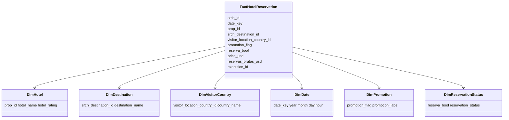
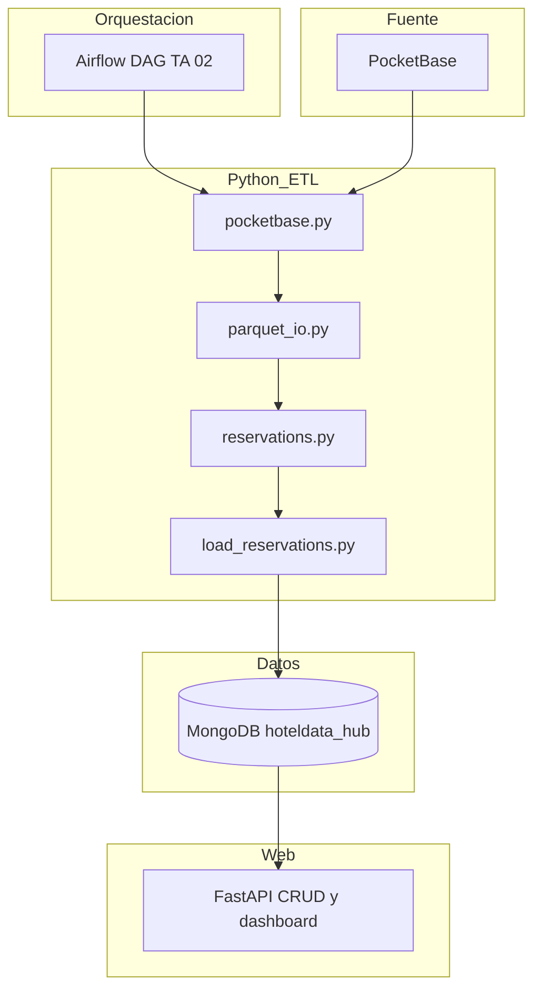
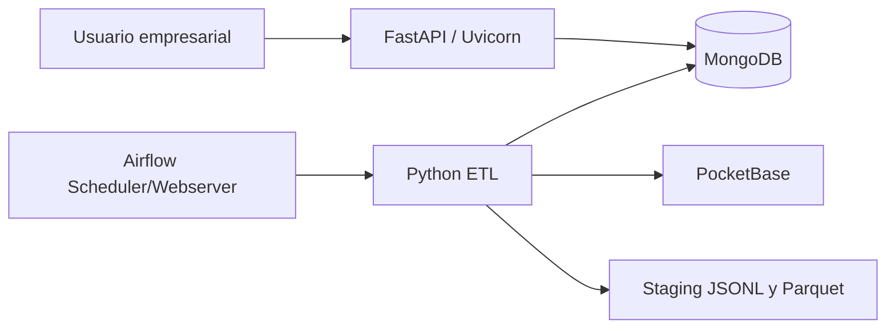

# TA 02 - UML, componentes y despliegue

## UML funcional

## Componentes

## Despliegue

## Restricciones

- Airflow no importa `src.app`.
- La web no ejecuta ETL principal.
- MongoDB es la persistencia final.
- Parquet es el formato intermedio obligatorio.
