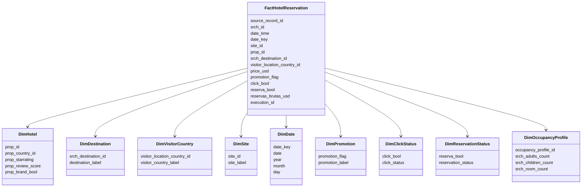
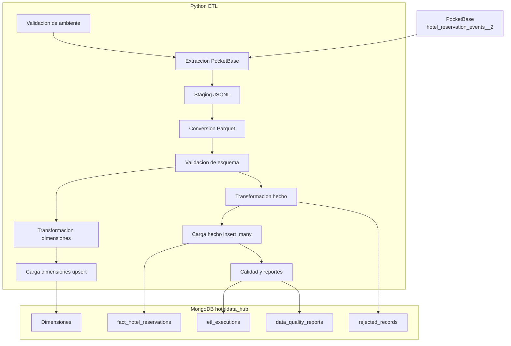
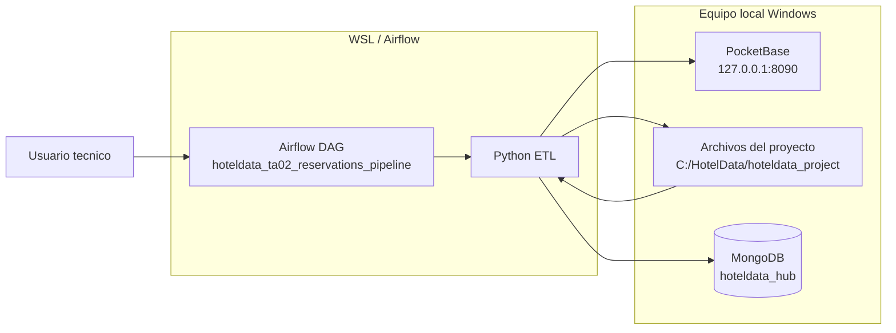

# Documentacion final TA 02 - HotelData

## 1. Empresa, mision y vision

### Empresa

HotelData Analytics es una plataforma empresarial orientada a integrar, transformar, auditar y consultar datos de reservas hoteleras. Su proposito es convertir eventos operacionales provenientes de PocketBase en informacion analitica confiable dentro de MongoDB, usando Python como lenguaje principal de movimiento de datos.

La solucion esta pensada para equipos de direccion comercial, revenue management, operaciones digitales y gobierno de datos que necesitan entender comportamiento de busqueda, conversion a reserva, precio, promocion, origen del visitante y patrones de ocupacion.

### Mision

Transformar datos operacionales de reservas hoteleras en informacion estructurada, trazable y confiable para apoyar decisiones comerciales, tacticas y operativas en la industria hotelera.

### Vision

Ser una plataforma de referencia para analitica hotelera empresarial, integrando fuentes operacionales, procesamiento en Python, almacenamiento en MongoDB y modelos dimensionales preparados para consulta, auditoria y toma de decisiones.

## 2. Objetivos estrategicos, tacticos y operativos

Para HotelData Analytics, los datos son el activo empresarial mas importante. Cada evento de busqueda, click, precio, promocion y reserva representa conocimiento comercial que puede convertirse en productividad, reduccion de incertidumbre y mayor margen de ganancia. Por esta razon, la plataforma organiza la informacion en una tabla de hechos y dimensiones que permiten tomar decisiones en tres niveles: estrategico, tactico y operativo.

| Objetivo estrategico de informacion | Informacion requerida | Decision tactica | Decision operativa | Impacto en productividad | Impacto en margen de ganancia |
| --- | --- | --- | --- | --- | --- |
| Aumentar la conversion de busquedas a reservas | `srch_id`, `click_bool`, `reserva_bool`, `date_key`, `site_id`, destino y pais del visitante | Identificar canales, destinos y segmentos con baja conversion para ajustar campanas, experiencia digital y priorizacion comercial | Monitorear diariamente eventos sin click o sin reserva y revisar segmentos con abandono alto | Reduce tiempo de analisis comercial al concentrar la atencion en segmentos con mayor oportunidad | Incrementa ingresos al convertir mas busquedas existentes en reservas efectivas |
| Optimizar ingresos por reservas hoteleras | `price_usd`, `reservas_brutas_usd`, hotel, destino, fecha y categoria de precio | Definir estrategias de revenue management por rango de precio, destino y temporalidad | Revisar precios extremos, ingresos por dia y hoteles con bajo rendimiento | Automatiza la lectura de ingresos y evita analisis manual sobre archivos dispersos | Mejora el margen al priorizar combinaciones de precio, destino y hotel con mayor retorno |
| Evaluar efectividad de promociones | `promotion_flag`, `reserva_bool`, `click_bool`, `price_usd`, `reservas_brutas_usd` | Comparar conversion e ingresos entre eventos con promocion y sin promocion | Detectar promociones que generan clicks pero no reservas o reservas con bajo valor bruto | Permite medir resultados promocionales con indicadores consistentes | Reduce gasto comercial improductivo y enfoca promociones en segmentos rentables |
| Mejorar segmentacion por pais de visitante y canal | `visitor_location_country_id`, `site_id`, destino, fechas, clicks y reservas | Diseñar estrategias por mercado de origen y canal de adquisicion | Consultar paises y sitios con mayor volumen, conversion o abandono | Acelera la segmentacion de clientes y evita decisiones generales poco precisas | Incrementa margen al dirigir esfuerzos comerciales hacia mercados con mejor respuesta |
| Optimizar ocupacion segun adultos, ninos, habitaciones y duracion | `srch_adults_count`, `srch_children_count`, `srch_room_count`, `srch_length_of_stay`, `occupancy_profile_id`, `stay_length_category_id` | Definir paquetes, tarifas y disponibilidad segun perfiles de ocupacion y longitud de estancia | Revisar perfiles frecuentes y estancias predominantes para apoyar operacion hotelera | Mejora la planificacion operativa de habitaciones, inventario y servicios asociados | Aumenta rentabilidad al adaptar oferta y precio al perfil de ocupacion mas demandado |
| Fortalecer gobierno y calidad de datos | `execution_id`, `loaded_at`, `rejected_records`, `etl_executions`, `data_quality_reports` | Establecer controles de calidad, trazabilidad y mejora continua del pipeline | Revisar rechazos, completitud y conteos finales por ejecucion | Reduce retrabajo tecnico y mejora confiabilidad de los datos disponibles | Protege el margen al evitar decisiones basadas en datos incompletos o inconsistentes |

### Alienacion entre objetivos, productividad y margen de ganancia

El modelo dimensional de HotelData Analytics permite transformar eventos operacionales de PocketBase en informacion empresarial preparada para el analisis. La tabla de hechos `fact_hotel_reservations` concentra los eventos de busqueda, click, precio y reserva, mientras que las dimensiones aportan contexto de hotel, destino, pais del visitante, sitio, fecha, promocion, estado de click, estado de reserva, ocupacion, estancia, anticipacion y precio. Esta organizacion convierte datos transaccionales en un activo analitico que puede ser consultado de forma consistente.

Desde el punto de vista estrategico, la direccion puede identificar donde se genera mayor valor: que destinos convierten mejor, que segmentos responden a promociones, que perfiles de ocupacion son mas rentables y que canales aportan mayor volumen. Esto permite orientar decisiones de crecimiento y rentabilidad con base en evidencia, no solo en intuicion. La informacion deja de ser un registro operativo aislado y se convierte en una herramienta para maximizar ingresos.

Desde el punto de vista tactico, las areas comerciales y de revenue management pueden ajustar precios, promociones, segmentos y prioridades de venta. Por ejemplo, al cruzar `promotion_flag`, `reserva_bool`, `price_category_id` y `reservas_brutas_usd`, la empresa puede distinguir promociones que generan margen de aquellas que solo generan actividad sin rentabilidad. De igual forma, el analisis por pais, canal y destino ayuda a focalizar recursos en mercados con mayor probabilidad de reserva.

Desde el punto de vista operativo, los equipos pueden monitorear cargas, rechazos, conteos y calidad de datos mediante `etl_executions`, `data_quality_reports` y `rejected_records`. Esto mejora la productividad porque reduce revisiones manuales, disminuye retrabajo y permite actuar rapidamente ante fallos de datos. La alineacion entre calidad, analitica y operacion permite que la empresa use sus datos como el recurso central para aumentar eficiencia y margen de ganancia.

## 3. Modelo dimensional

### Tabla de hecho

Coleccion principal:

```text
fact_hotel_reservations
```

Representa eventos de busqueda/reserva hotelera. Cada documento contiene identificadores de busqueda, hotel, destino, visitante, sitio, fecha, indicadores de promocion/click/reserva, metricas de precio y atributos de ocupacion.

Campos principales:

| Campo | Descripcion |
| --- | --- |
| `source_record_id` | Identificador original del registro en PocketBase |
| `srch_id` | Identificador de busqueda |
| `date_time` | Fecha y hora del evento |
| `date_key` | Llave de fecha derivada |
| `site_id` | Sitio o canal de origen |
| `visitor_location_country_id` | Pais del visitante |
| `visitor_hist_starrating` | Historial de estrellas del visitante |
| `visitor_hist_adr_usd` | Historial ADR del visitante |
| `prop_country_id` | Pais del hotel |
| `prop_id` | Identificador del hotel |
| `prop_starrating` | Estrellas del hotel |
| `prop_review_score` | Puntaje de reseñas |
| `prop_brand_bool` | Indicador de hotel de marca |
| `prop_location_score1` | Puntaje de ubicacion |
| `price_usd` | Precio en USD |
| `promotion_flag` | Indicador de promocion |
| `srch_destination_id` | Destino buscado |
| `srch_length_of_stay` | Duracion de estancia |
| `srch_booking_window` | Anticipacion de reserva |
| `srch_adults_count` | Cantidad de adultos |
| `srch_children_count` | Cantidad de ninos |
| `srch_room_count` | Cantidad de habitaciones |
| `click_bool` | Indicador de click |
| `reserva_bool` | Indicador de reserva |
| `reservas_brutas_usd` | Valor bruto reservado |
| `occupancy_profile_id` | Perfil de ocupacion derivado |
| `stay_length_category_id` | Categoria de duracion |
| `booking_window_category_id` | Categoria de anticipacion |
| `price_category_id` | Categoria de precio |
| `loaded_at` | Fecha de carga |
| `execution_id` | Ejecucion ETL |

### Dimensiones

| Dimension | Llave | Proposito |
| --- | --- | --- |
| `dim_hotels` | `prop_id` | Describe propiedades hoteleras |
| `dim_destinations` | `srch_destination_id` | Describe destinos buscados |
| `dim_visitor_countries` | `visitor_location_country_id` | Describe paises de origen del visitante |
| `dim_sites` | `site_id` | Describe sitios o canales |
| `dim_dates` | `date_key` | Permite analisis temporal |
| `dim_promotions` | `promotion_flag` | Clasifica eventos con/sin promocion |
| `dim_click_status` | `click_bool` | Clasifica eventos con/sin click |
| `dim_reservation_status` | `reserva_bool` | Clasifica eventos reservados/no reservados |
| `dim_occupancy_profile` | `occupancy_profile_id` | Describe adultos, ninos y habitaciones |
| `dim_stay_length_category` | `stay_length_category_id` | Agrupa duracion de estancia |
| `dim_booking_window_category` | `booking_window_category_id` | Agrupa anticipacion de reserva |
| `dim_price_category` | `price_category_id` | Agrupa precios |

### Colecciones de control

| Coleccion | Uso |
| --- | --- |
| `rejected_records` | Registros invalidos o rechazados |
| `etl_executions` | Historial de ejecuciones |
| `data_quality_reports` | Reportes de calidad por ejecucion |

## 4. Casos de uso principales

### CU01 - Ejecutar pipeline TA 02 completo

Actor principal: Operador de datos.

Descripcion: Ejecuta el flujo empresarial de integracion de datos PocketBase -> JSONL -> Parquet -> dimensiones + hecho -> MongoDB, garantizando trazabilidad y control de calidad.

Condiciones de aceptacion:

- El sistema extrae registros desde PocketBase.
- El sistema genera archivo JSONL en staging.
- El sistema genera archivo Parquet antes de cargar MongoDB.
- El sistema carga dimensiones y `fact_hotel_reservations`.
- El sistema registra `execution_id`.
- El sistema guarda `etl_executions` y `data_quality_reports`.

### CU02 - Validar fuente PocketBase

Actor principal: Ingeniero de datos.

Descripcion: Verifica la disponibilidad de la fuente operacional PocketBase y confirma que la coleccion contiene registros y columnas esperadas antes de iniciar procesos de carga.

Condiciones de aceptacion:

- El sistema autentica con superuser.
- El sistema consulta los primeros registros.
- El sistema muestra `status code`, `totalItems`, columnas y registros de muestra.
- La validacion no modifica datos.

### CU03 - Convertir muestra PocketBase a Parquet

Actor principal: Ingeniero de datos.

Descripcion: Extrae una muestra controlada desde PocketBase, la guarda como JSONL y la convierte a Parquet para validar el formato intermedio sin afectar MongoDB.

Condiciones de aceptacion:

- Se extraen 1000 registros.
- Se genera `pocketbase_sample.jsonl`.
- Se genera `pocketbase_sample.parquet`.
- El Parquet puede leerse correctamente.
- No se carga nada a MongoDB en esta prueba.

### CU04 - Cargar modelo dimensional en MongoDB

Actor principal: Operador de datos.

Descripcion: Carga el modelo dimensional en MongoDB, aplicando upsert para datos maestros e insercion por lotes para la tabla de hechos.

Condiciones de aceptacion:

- Las dimensiones se cargan con upsert.
- La tabla de hecho se carga con `insert_many`.
- Los registros invalidos van a `rejected_records`.
- Se muestran conteos finales por coleccion.

### CU05 - Auditar ejecuciones del ETL

Actor principal: Auditor de datos.

Descripcion: Revisa ejecuciones, conteos, rechazos y calidad de datos para asegurar gobierno, trazabilidad y confianza en la informacion.

Condiciones de aceptacion:

- Cada ejecucion tiene `execution_id`.
- `etl_executions` contiene fecha, estado y colecciones cargadas.
- `data_quality_reports` contiene filas fuente, hechos validos, rechazados y completitud.
- Los rechazos pueden rastrearse por ejecucion.

## 5. Historias de usuario

### HU01 - Ejecutar carga completa de reservas

Como operador de datos, quiero ejecutar el pipeline completo TA 02 para cargar reservas hoteleras desde PocketBase hacia MongoDB con trazabilidad empresarial.

Criterios de aceptacion:

- El pipeline extrae datos desde PocketBase.
- El pipeline genera JSONL y Parquet.
- El pipeline carga dimensiones y hechos.
- El pipeline registra `execution_id`.

### HU02 - Validar la conexion con PocketBase

Como ingeniero de datos, quiero validar PocketBase antes de cargar para confirmar que la fuente operacional este disponible y sea confiable.

Criterios de aceptacion:

- Se autentica con superuser.
- Se consultan 5 registros.
- Se muestran columnas detectadas y `totalItems`.

### HU03 - Usar Parquet como formato intermedio

Como ingeniero de datos, quiero convertir la extraccion a Parquet para disponer de un formato intermedio eficiente, verificable y reutilizable antes de MongoDB.

Criterios de aceptacion:

- El Parquet se genera despues del JSONL.
- El Parquet se lee correctamente.
- Se muestran columnas, tipos y cantidad de filas.

### HU04 - Separar dimensiones y hechos

Como analista de datos, quiero que las reservas se organicen en hecho y dimensiones para facilitar analisis empresarial de conversion, ingresos, ocupacion y calidad.

Criterios de aceptacion:

- Existe `fact_hotel_reservations`.
- Existen dimensiones de hotel, destino, pais visitante, sitio, fecha, promocion, click, reserva, ocupacion, estancia, anticipacion y precio.
- Las llaves dimensionales estan presentes en la tabla de hecho.

### HU05 - Registrar calidad de datos

Como responsable de gobierno de datos, quiero conocer registros validos y rechazados para medir la calidad, completitud y confiabilidad de cada carga.

Criterios de aceptacion:

- Se guarda `data_quality_reports`.
- Se guarda `rejected_records` si hay errores.
- El reporte incluye `source_rows`, `valid_fact_records`, `rejected_records` y `completeness_score`.

### HU06 - Evitar duplicacion innecesaria de dimensiones

Como operador de datos, quiero cargar dimensiones con upsert para actualizar datos maestros sin perder historico ni borrar informacion innecesariamente.

Criterios de aceptacion:

- Las dimensiones usan upsert.
- El hecho puede recargarse controladamente.
- No se eliminan dimensiones si no hace falta.

### HU07 - Auditar ejecuciones

Como auditor, quiero consultar el historial de ejecuciones para verificar cuando, como y con que resultado se cargaron los datos.

Criterios de aceptacion:

- Cada ejecucion guarda `execution_id`.
- `etl_executions` registra estado y fecha.
- La ejecucion referencia conteos por coleccion.

## 6. Diagrama UML funcional



## 7. Diagrama de componentes



## 8. Diagrama de despliegue inicial



## Estado validado de TA 02

El pipeline completo fue validado por script local. El DAG Airflow reproduce el mismo flujo y se encuentra en validacion de ejecucion.

Flujo probado por script local:

```text
PocketBase -> JSONL -> Parquet -> Dimensiones + Hecho -> MongoDB
```

Resultado validado:

| Elemento | Resultado |
| --- | --- |
| Coleccion PocketBase | `hotel_reservation_events__2` |
| Registros leidos | `201000` |
| JSONL | `data/staging/pocketbase_full_extract.jsonl` |
| Parquet | `data/processed/hotel_reservations_full.parquet` |
| Hecho MongoDB | `fact_hotel_reservations` |
| Registros en hecho | `201000` |
| Rechazados | `0` |
| Execution ID validado | `ta02_full_20260520011431` |
