# PlantUML GA03

Este documento se conserva por compatibilidad. Los diagramas vigentes de GA03 son:

- `docs/ga03/diagrama_casos_uso_ga03.md`
- `docs/ga03/diseno_base_datos_ga03.md`
- `diagrams/ga03_use_cases.puml`
- `diagrams/ga03_database.puml`

## Decisión vigente

- Casos de uso: 32.
- Paquetes: 8.
- Base MongoDB: `hoteldata_hub`.
- PocketBase: `hotel_reservation_events_03`.
- DAG: `hoteldata_reservas_03_pipeline`.
- Preparación administrativa: CSV -> PocketBase.
- ETL principal: PocketBase -> JSONL -> Parquet -> MongoDB.

## Diagrama de casos de uso

```plantuml
@startuml
left to right direction
skinparam packageStyle rectangle

actor "Usuario operativo" as Usuario
actor "Administrador" as Admin
rectangle "PocketBase\nSistema tecnico externo" as PB
rectangle "MongoDB\nSistema tecnico externo" as MDB

rectangle "HotelData Hub Analytics - GA03" {
  package "1. Experiencia del cliente y busqueda hotelera" {
    usecase "CU01 Buscar hoteles" as CU01
    usecase "CU02 Filtrar hoteles" as CU02
    usecase "CU03 Consultar detalle de hotel" as CU03
    usecase "CU04 Comparar hoteles" as CU04
  }
  package "2. Cuenta, sesion y perfil de usuario" {
    usecase "CU05 Registrarse" as CU05
    usecase "CU06 Iniciar sesion y validar rol" as CU06
    usecase "CU07 Gestionar perfil" as CU07
    usecase "CU08 Consultar historial" as CU08
  }
  package "3. Core de reservas hoteleras" {
    usecase "CU09 Crear solicitud de reserva" as CU09
    usecase "CU10 Consultar estado de reserva" as CU10
    usecase "CU11 Cancelar reserva" as CU11
    usecase "CU12 Registrar reserva manual" as CU12
  }
  package "4. Gestion hotelera / Partner Central" {
    usecase "CU13 Administrar perfil del hotel" as CU13
    usecase "CU14 Administrar imagenes y contenido" as CU14
    usecase "CU15 Administrar politicas" as CU15
    usecase "CU16 Consultar rendimiento" as CU16
  }
  package "5. Habitaciones, inventario y disponibilidad" {
    usecase "CU17 Administrar tipos de habitacion" as CU17
    usecase "CU18 Administrar inventario" as CU18
    usecase "CU19 Bloquear fechas" as CU19
    usecase "CU20 Sincronizar disponibilidad" as CU20
  }
  package "6. Tarifas, promociones y revenue" {
    usecase "CU21 Administrar planes tarifarios" as CU21
    usecase "CU22 Configurar tarifas" as CU22
    usecase "CU23 Crear campanas" as CU23
    usecase "CU24 Evaluar promociones" as CU24
  }
  package "7. Analytics, BI y toma de decisiones" {
    usecase "CU25 Consultar dashboard" as CU25
    usecase "CU26 Analizar conversion" as CU26
    usecase "CU27 Analizar ingresos" as CU27
    usecase "CU28 Analizar comportamiento" as CU28
  }
  package "8. Administracion, datos, ETL y gobierno" {
    usecase "CU29 Ejecutar pipeline ETL" as CU29
    usecase "CU30 Validar calidad y rechazados" as CU30
    usecase "CU31 Administrar usuarios y permisos" as CU31
    usecase "CU32 Consultar auditoria" as CU32
  }
}

Usuario --> CU01
Usuario --> CU02
Usuario --> CU03
Usuario --> CU04
Usuario --> CU05
Usuario --> CU06
Usuario --> CU07
Usuario --> CU08
Usuario --> CU09
Usuario --> CU10
Usuario --> CU11
Usuario --> CU25
Usuario --> CU26
Usuario --> CU27
Usuario --> CU28

Admin --> CU12
Admin --> CU13
Admin --> CU14
Admin --> CU15
Admin --> CU16
Admin --> CU17
Admin --> CU18
Admin --> CU19
Admin --> CU20
Admin --> CU21
Admin --> CU22
Admin --> CU23
Admin --> CU24
Admin --> CU29
Admin --> CU30
Admin --> CU31
Admin --> CU32

CU29 .. PB
CU29 .. MDB
CU30 .. MDB
CU32 .. MDB
@enduml
```

