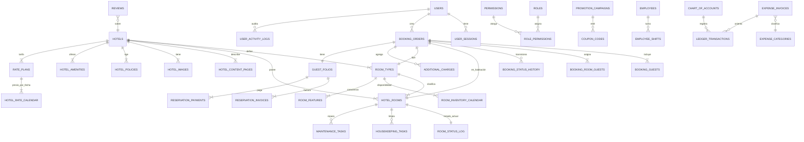
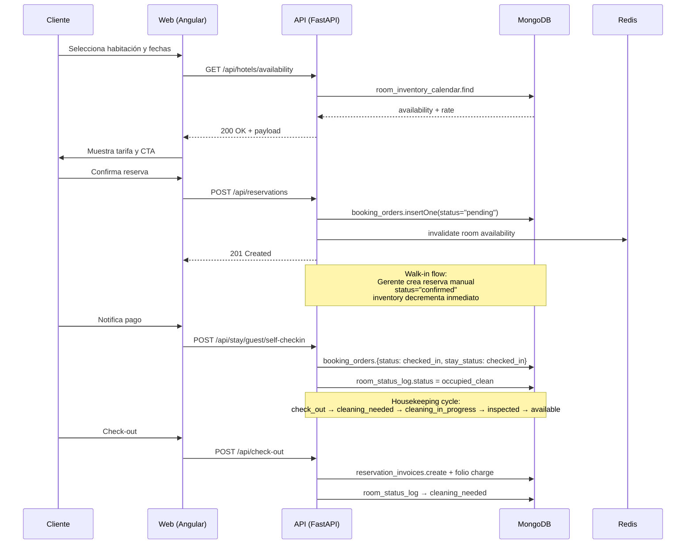
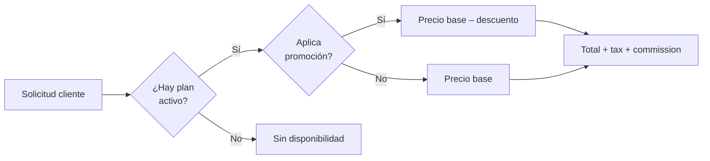
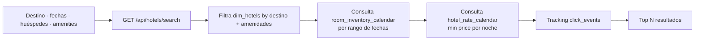
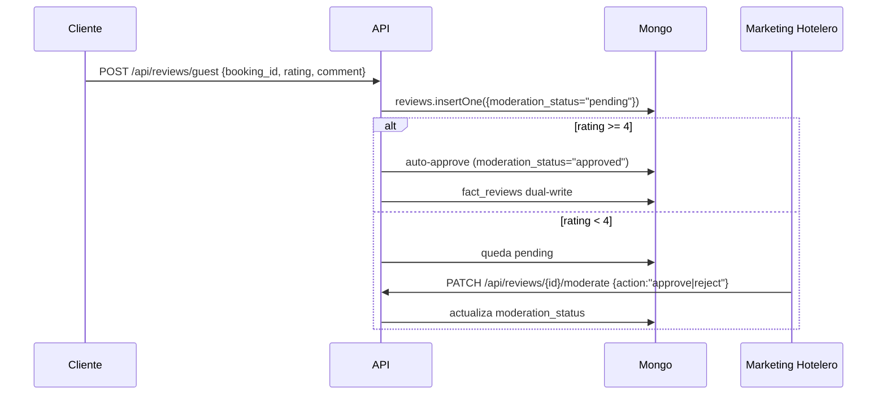

# HotelData — Knowledge Base

> Documento de referencia única del sistema. Cubre arquitectura, módulos, entidades, relaciones, reglas de negocio y los flujos PMS / CRS / Booking Engine / CRM. Mantener sincronizado con `state_machine.md` y `MIGRATION_PLAN.md`.

**Versión**: 1.0  
**Stack**: Angular 22 · FastAPI · MongoDB · PocketBase · Redis · Airflow  
**Última sincronización**: Julio 2026

## TL;DR

- **Monolito modular**: FastAPI atrás de un Nginx que también sirve el Angular 22 dist. Capa de servicios Python con MongoDB como motor primario.
- **Event-driven CDC**: PocketBase es la "source of truth" de demo; un `change_stream_watcher` sincroniza a Mongo casi en tiempo real y un DAG de Airflow (`hoteldata_ga03_etl`) hace el ETL garantizado e idempotente (full o incremental según `GA03_INCREMENTAL_MODE`).
- **Multi-tenant por hotel + multi-moneda**: cada operación filtra por `prop_id` salvo super_admin; `system_currencies` define las monedas disponibles y un `PropertyCurrencyPipe` formatea el render en el frontend.
- **API-first**: todos los routers exponen `router` (UI web), `api_router` (JSON), `web_router` (formularios) y rara vez `public_router` (sin auth). El contrato vivo vive en `http://localhost:8000/docs` (Swagger auto-generado).
- **Cuatro flujos de negocio**: PMS (housekeeping/check-in/inventario), CRS (tarifas/promociones/blackouts), Booking Engine (búsqueda/reserva/cliente) y CRM (reseñas/objetos perdidos/in-stay).

---

## Tabla de contenidos (5 macro-secciones)

### I. Visión general & arquitectura
1. [Visión general](#1-visión-general)
2. [Arquitectura](#2-arquitectura)
3. [Stack y servicios (Docker Compose)](#3-stack-y-servicios-docker-compose)
19. [Convenciones del proyecto](#19-convenciones-del-proyecto)
20. [Cómo correr el sistema en local](#20-cómo-correr-el-sistema-en-local)

### II. Módulos
4. [Módulos del backend](#4-módulos-del-backend)
5. [Módulos del frontend (Angular 22)](#5-módulos-del-frontend-angular-22)

### III. Datos, entidades & estado
6. [Entidades MongoDB y PocketBase (modelo de datos)](#6-entidades-mongodb-y-pocketbase-modelo-de-datos)
8. [Relaciones entre entidades](#8-relaciones-entre-entidades)
10. [State Machines](#10-state-machines)
18. [Cache, sesiones y observabilidad](#18-cache-sesiones-y-observabilidad)

### IV. Lógica y flujos de negocio
11. [Reglas de negocio](#11-reglas-de-negocio)
12. [Flujo PMS (Property Management System)](#12-flujo-pms-property-management-system)
13. [Flujo CRS (Central Reservation System)](#13-flujo-crs-central-reservation-system)
14. [Flujo Booking Engine](#14-flujo-booking-engine)
15. [Flujo CRM (Guest Experience / Loyalty)](#15-flujo-crm-guest-experience--loyalty)
16. [Pipeline ETL CSV → PocketBase → MongoDB](#16-pipeline-etl-csv--pocketbase--mongodb)

### V. Operaciones, seguridad & endpoints
9. [Roles y matriz de permisos](#9-roles-y-matriz-de-permisos)
17. [Seguridad, middleware y rate limiting](#17-seguridad-middleware-y-rate-limiting)
21. [Mapa rápido de endpoints](#21-mapa-rápido-de-endpoints)
22. [Tests y validaciones](#22-tests-y-validaciones)

---

## 1. Visión general

**HotelData** es una plataforma académica de gestión hotelera y analítica, basada en una arquitectura **modular monolítica** con separación clara de capas:

- **Frontend SPA** (Angular 22) con lazy loading y zoneless-friendly.
- **Backend API** (FastAPI, Pydantic v2) organizado por dominios de negocio.
- **MongoDB** como base operativa principal (colecciones dimensionales y de hechos).
- **PocketBase** como sistema origen para datos de muestra y ETL determinístico.
- **Airflow 3** (en Docker, despliegue descompuesto) como orquestador del pipeline de extracción/transformación/carga.
- **Redis** como caché compartido (incluye sesiones de UI y verrou de inventario distribuido).
- **Change Stream Watcher** como puente reactivo PocketBase → MongoDB para datos casi en tiempo real.

El sistema soporta los cuatro ejes de la operación hotelera moderna:

- **PMS** (Property Management): housekeeping, mantenimiento, check-in/out, inventario físico.
- **CRS** (Central Reservation): planes tarifarios, promociones, calendarios de tarifa, inventario por fecha.
- **Booking Engine**: búsqueda, comparación, reserva (cliente), disponibilidad en tiempo real.
- **CRM**: huéspedes, reseñas, fidelización, objetos perdidos, in-stay portal, reputación.

---

## 2. Arquitectura

```
                  ┌──────────────────────────────────────────────┐
                  │              Browser / Cliente              │
                  │   Angular 22 SPA  —  http(s)://host          │
                  └───────────────────────┬──────────────────────┘
                                          │ HTTPS / Nginx
                                          ▼
        ┌─────────────────────────────────────────────────────────────┐
        │                  Nginx (frontend container)                │
        │  Sirve dist + proxy /api → FastAPI uvicorn                 │
        └─────────────────────────┬───────────────────────────────────┘
                                  │ /api/* (JSON, cookie session)
                                  ▼
        ┌─────────────────────────────────────────────────────────────┐
        │                  FastAPI app (uvicorn)                      │
        │   role_access_middleware → routers → services → Mongo       │
        └────────┬───────────────┬───────────────────┬─────────────────┘
                 │               │                   │
                 ▼               ▼                   ▼
         ┌──────────────┐  ┌─────────────┐    ┌─────────────────┐
         │   MongoDB    │  │   Redis     │    │  Airflow (DAGs) │
         │  (state +    │  │ (cache +    │    │  ETL orquestado │
         │   facts +    │  │ sessions)   │    └────────┬────────┘
         │   dim)       │  └─────────────┘             │
         └──────▲───────┘                              ▼
                │                              ┌──────────────┐
                │          change-stream       │  PocketBase  │
                │          watcher (CDC)       │  (fuente)    │
                │                              └──────────────┘
```

### Capas y responsabilidades

| Capa | Tecnología | Responsabilidad |
|---|---|---|
| Presentación | Angular 22 + Signals + httpResource | UI zoneless-friendly, OnPush, design tokens (`_scss-variables.scss`). |
| Proxy / hosting | Nginx (docker `frontend`) | SPA + proxy a FastAPI. |
| API HTTP | FastAPI · Pydantic v2 · slowapi | Routers por dominio, validación, rate-limit, seguridad. |
| Servicios | Python (asyncio-friendly) | Lógica de negocio (reservas, billing, housekeeping, revenue). |
| Persistencia | MongoDB (motor primario) | Colecciones dimensionales + hechos + log. |
| Caché | Redis | Cache de KPIs, sesiones Redis, lock optimista opcional. |
| ETL | Airflow 3.2.2 (Docker) | Despliegue único descompuesto (`airflow-postgres`, `airflow-init`, API server, scheduler, DAG processor, triggerer y worker Celery); DAG `hoteldata_ga03_etl` (CSV→PocketBase→validación→MongoDB). |
| CDC | `hoteldata_change_stream_watcher` | Sincroniza PocketBase → MongoDB en near-real-time. |
| Source-of-truth de demo | PocketBase | Datos de muestra, generación sintética. |

---

## 3. Stack y servicios (Docker Compose)

Servicios definidos en `infra/docker-compose.yml`:

| Servicio | Imagen / Build | Puerto host | Función |
|---|---|---|---|
| `mongo` | `mongo:7` | 27017 | Persistencia principal |
| `redis` | `redis:7-alpine` | 6379 | Cache + sesiones |
| `pocketbase` | `pocketbase:0.22` | 8090 | Fuente de datos para ETL/CDC |
| `airflow-postgres` + `airflow-*` | custom + `postgres:16` | 8080 (API) | Un despliegue lógico Airflow 3 descompuesto; no un Airflow por dominio o tenant |
| `server` | custom (FastAPI) | 8000 | API de la aplicación |
| `frontend` | Nginx + Angular dist | 8081 | UI servida |
| `change_stream_watcher` | custom Python | — | PocketBase → MongoDB CDC |

Variable clave del ETL: `GA03_INCREMENTAL_MODE` (`true`/`false`). Default: `false` (full load).

---

## 4. Módulos del backend

Organizados bajo `server/src/app/modules/` y `server/src/app/features/`. Cada módulo expone hasta 4 routers con prefijos estables:

- `router` (prefijo `/modules/<name>`) — web/views
- `api_router` (prefijo `/api/<name>`) — JSON
- `public_router` (prefijo `/api/<public>`) — no autenticado
- `web_router` (prefijo `/<name>`) — formularios

### Catálogo de módulos

| Módulo | Prefijo API | Rol funcional |
|---|---|---|
| `auth` | `/api/auth` | Login, register, JWT, password, profile, heartbeat |
| `account` | `/api/account` | Cuenta del cliente (perfil, avatar, verify-email) |
| `users` | `/modules/users`, `/api/users` | Estado del módulo y roles asignados |
| `admin` | `/api/admin`, `/admin` | Seguridad, ownership de hoteles, roles |
| `audit` | `/audit`, `/api/audit` | Auditoría operativa |
| `settings` | `/api/settings` | Settings por usuario |
| `global_settings` | `/api/admin/global-settings` | Configuración global, taxes, commission rates |
| `partner` (multi-router) | `/api/management`, `/api/public`, `/partner` | Hoteles, contenido, habitaciones, amenities, rates, currency |
| `hotels` | `/api/hotels` | Búsqueda pública, compare, similar |
| `reservations` | `/api/reservations`, `/api/management`, `/api/check-in` | Reservas cliente + management + self check-in |
| `housekeeping` | `/api/housekeeping` | Estados de habitación, limpieza, mantenimiento, cargos |
| `billing` | `/api/billing` | Facturas, pagos, folios, servicios adicionales |
| `expenses` | `/api/expenses` | Gastos, presupuestos, libro mayor (chart_of_accounts) |
| `revenue` | `/api/management`, `/modules/revenue` | Rate plans, calendar, promotions, contratos |
| `hr` | `/api/hr` | Empleados, departamentos, turnos |
| `reviews` | `/api/reviews`, `/api/hotels` (públicas) | CRUD reseñas, moderación, reputación |
| `amenities` | `/api/amenities/guest`, `/api/amenities/stock` | Catálogo y stock de amenities |
| `map` | `/api/map` | Mapa mundial, editor de destinos |
| `geo_catalog` | `/api/geo` | Catálogo geográfico (países, destinos, sitios, hoteles) |
| `notifications` | `/api/notifications` | Notificaciones del sistema |
| `lost_and_found` | `/api/lost-and-found` | Objetos perdidos y encontrados |
| `instay` | `/api/stay/guest`, `/api/stay` | Portal del huésped (guest) + staff inbox. Chat y service-requests viven dentro de estos mismos routers, no como prefijo propio. |
| `payments` | `/api/payments` | Pasarela de pagos |
| `kpi` | `/api/kpi` | KPIs y métricas |
| `reports` | `/api/reports` | Generación de PDFs/reportes |
| `reception` | `/api/reception`, `/api/reception/calendar` | Turnos de recepción, calendario |
| `shifts` | (frontend-coupled) | Turnos de caja |
| `tracking` | `/api/tracking` | Eventos de UI (clicks, scroll, conversion) |
| `system` | `/system/redis-status` | Salud de servicios |
| `etl_status` | `/api/etl-status/*` | Estado y disparo del pipeline |
| `dashboard` | `/api/dashboard` | KPIs ejecutivos |

Carpeta especial: `src/app/core/` contiene el State Machine central (`core/state_machine.py`), outbox, middlewares transversales.

### 4.1 Conflicto conocido: prefijo `/api/management` compartido

⚠️ **Trampa semántica**: cuatro routers distintos en módulos distintos registran el mismo prefijo `/api/management`:

- `partner/api_router` — gestión de hoteles/contenido/rates
- `revenue/api_router` — planes tarifarios, promociones, contratos
- `reservations/routes/management.py:management_api_router` — operaciones de reservas/check-in
- `partner/routes/hotel_products.py:router` — productos del hotel

FastAPI acepta la superposición pero **la ruta final depende del orden de `app.include_router()` en `main.py`** y de la primera coincidencia por prefijo + método. Cualquier nueva ruta bajo `/api/management/*` debe verificar contra `main.py` (orden de inclusión) y contra el OpenAPI generado para evitar caer en el router equivocado. Cuando se agreguen nuevas rutas en estos módulos, conviene usar prefijos más específicos (`/api/management/rates/*`, `/api/management/products/*`) en lugar de depender de `/api/management` plano.

---

## 5. Módulos del frontend (Angular 22)

Agrupados bajo `frontend/src/app/features/`. Convención: lazy-loaded standalone components, ChangeDetectionStrategy.OnPush por defecto, signals + httpResource.

| Feature | Descripción |
|---|---|
| `welcome` | Landing público B2C, currency chip, preview de reservas. |
| `hotel-search` | Búsqueda pública con filtros. |
| `hotel-compare` | Vista comparativa 2-3 hoteles. |
| `hotel-detail` | Detalle + reseñas públicas. |
| `reservations` | Crear, listar, detalle, confirmar (cliente). |
| `account` | Perfil del cliente logueado. |
| `auth` (en core) | Login, register, recover, reset, verify-email. |
| `admin` | Panel de admin del sistema. |
| `system-admin` | Usuarios, permisos, audit, monitoring, currencies, notifications. |
| `ownership` | Asignación de hoteles↔usuarios (sys-admin). |
| `properties` | Listado, edición, detalle de hoteles (partner). |
| `policies` | Edición de políticas hoteleras. |
| `rooms` | Tipos de habitación y habitaciones físicas. |
| `amenities` | Catálogo + stock de amenities. |
| `rates` | Rate plans, calendar, promotions. |
| `availability` | Inventario por fecha y blackout dates. |
| `manual-reservations` | Walk-in reservation (recepción). |
| `check-ins` | Gestión de check-in. |
| `check-outs` | Gestión de check-out. |
| `housekeeping` | Room status, tasks, maintenance, charges, dashboard, calendar. |
| `billing` | Facturas, pagos, folios, client-invoices. |
| `expenses` | Ledger, gastos, presupuestos. |
| `hr` | Empleados, onboarding, dashboard. |
| `reviews` | Listado, detalle, moderación, reputación. |
| `notifications` | Bandeja de notificaciones. |
| `lost-and-found` | Gestión de objetos perdidos. |
| `in-stay` | Guest portal + Staff inbox. |
| `map` | Mapa mundial y editor de destinos. |
| `geo-catalog` | Catálogo geográfico. |
| `management` | Dashboard de management, settings, reports, audit log. |
| `guests` | Gestión de huéspedes (CRM). |
| `shifts` | Control de turnos de caja. |
| `notifications` | Bandeja. |

`core/` agrupa servicios transversales: auth, api, navigation, theme, layout, etc.  
`shared/` agrupa pipes, componentes UI reutilizables, servicios de contexto (PropertyContextService, ThemeService).

Convención de routing: el archivo raíz `frontend/src/app/app.routes.ts` define `loadComponent` para cada feature, lazificándolas.

---

## 6. Entidades MongoDB y PocketBase (modelo de datos)

### 6.0 Fuentes de datos en simultáneo

El sistema mantiene **dos motores de almacenamiento cooperando**:

1. **MongoDB** — base operativa principal. Colecciones dimensionales, de hechos, log de cambios, auditoría. Aseguradas vía funciones `ensure_<name>_collections()` que se ejecutan en el `lifespan` de FastAPI al arrancar (`main.py`).
2. **PocketBase** — fuente de demo source-of-truth para el ETL. Datos sintéticos generados por `seed_master_collections.py` + datos de muestra. Sincronizado a MongoDB por: (a) `change_stream_watcher` (CDC near-realtime) y (b) DAG `hoteldata_ga03_etl` (idempotente, batch, full/incremental).

Las dos fuentes deben terminar reflejando el mismo dominio. Si divergen, es bug (mirar logs del watcher y del DAG en `etl-status`).

### 6.1 Núcleo operativo MongoDB (PMS/CRS)

| Colección | Función | Campos clave |
|---|---|---|
| `booking_orders` | Reservas (estado y estancia) | `prop_id`, `room_type_id`, `check_in/check_out`, `status`, `stay_status`, totales |
| `booking_guests` | Huéspedes por reserva | `booking_id`, `full_name`, `id_document` |
| `booking_status_history` | Log de transiciones | `booking_id`, `from_status`, `to_status`, `actor_id` |
| `booking_room_guests` | Asignación hab↔huésped | `booking_id`, `room_id`, `guest_index` |
| `manual_reservations` | Reservas manuales (walk-in) | `booking_id`, `created_by` |
| `room_types` | Tipos de habitación | `prop_id`, `code`, `capacity`, `base_rate` |
| `hotel_rooms` | Habitaciones físicas | `prop_id`, `room_type_id`, `room_number` |
| `room_status_log` | Estado actual de habitación | `room_id`, `status`, `version` (optimistic lock) |
| `room_inventory_calendar` | Disponibilidad por fecha | `room_type_id`, `date`, `available_rooms`, `blocked_rooms`, `version` |
| `blackout_dates` | Fechas bloqueadas | `prop_id`, `room_type_id`, `from_date`, `to_date`, `reason` |
| `room_availability_blocks` | Reservas/bloqueos vivos | `prop_id`, `date`, `quantity` |
| `housekeeping_tasks` | Tareas de limpieza | `room_id`, `assigned_to`, `status`, `priority` |
| `maintenance_tasks` | Mantenimiento programado | `room_id`, `scheduled_at`, `status`, `category` |
| `additional_charges` | Cargos al folio | `booking_id`, `concept`, `amount` |
| `reception_shifts` | Turnos de recepción | `user_id`, `start_time`, `end_time`, `status` |

### 6.2 Revenue / CRS

| Colección | Función |
|---|---|
| `rate_plans` | Planes tarifarios por propiedad |
| `rate_rules` | Reglas (los días, restricciones) por plan |
| `hotel_rate_calendar` | Tarifa por fecha y plan |
| `room_features` | Features de cada room_type |
| `promotion_campaigns` | Campañas promocionales |
| `coupon_codes` | Cupones asociados a campañas |
| `corporate_contracts` | Contratos corporativos |

### 6.3 Billing / Finance

| Colección | Función |
|---|---|
| `guest_folios` | Folio del huésped por reserva |
| `reservation_invoices` | Facturas operativas |
| `reservation_payments` | Pagos aplicados |
| `fact_reservation_invoices` | Hechos para analytics (dual-write) |
| `fact_reservation_payments` | Hechos para analytics |
| `expense_invoices` | Gastos operativos |
| `expense_categories` | Categorías de gasto |
| `expense_budget` | Presupuesto por categoría/periodo |
| `ledger_transactions` | Asientos del libro mayor |
| `chart_of_accounts` | Plan de cuentas |

### 6.4 Identidad / Permisos / Auditoría

| Colección | Función |
|---|---|
| `users` | Usuarios del sistema |
| `user_sessions` | Sesiones activas (cookie ↔ token) |
| `roles` | Definición de roles con permisos |
| `permissions` | Permisos atómicos |
| `role_permissions` | Join rol↔permiso |
| `user_activity_logs` | Auditoría operativa |
| `audit_log` | Auditoría del partner module |
| `audit_indexes` | Índices asociados al audit |

### 6.5 Contenido / CRM

| Colección | Función |
|---|---|
| `dim_hotels` / `hotels` | Hotel dimensional |
| `hotel_content_pages` | Contenido comercial (descripción, highlights) |
| `hotel_images` | Imágenes de la propiedad |
| `hotel_policies` | Check-in/out, cancelación, mascotas |
| `hotel_amenities` | Amenities activas por hotel |
| `hotel_profile` / `hotel_profile_changes` | Override del ETL (manual_override=true) |
| `hotel_content_changes` | Auditoría de cambios de contenido |
| `reviews` | Reseñas (`moderation_status`, `rating`) |
| `fact_reviews` | Hecho analytics de reseñas |
| `review_reports` | Reportes de abuso sobre reseñas |
| `lost_items` | Objetos perdidos |
| `service_requests` | Solicitudes in-stay |

### 6.6 Catalogos maestros

| Colección | Función |
|---|---|
| `system_currencies` | Monedas soportadas (visible vía `/api/public/currencies`) |
| `tax_rates` | Impuestos por país |
| `commission_rates` | Comisiones por propiedad |
| `geo_*` | Catálogo geográfico |
| `employees` + `employee_*` | RRHH |
| `amenities_catalog` | Catálogo de amenities |

### 6.7 Operacional / Notificaciones / Cache

| Colección | Función |
|---|---|
| `notifications` | Cola de notificaciones |
| `kpi_cache` | Cache de KPIs |
| `outbox` | Outbox transaccional (consumida al arrancar) |
| `change_stream_watermarks` | Control de CDC |

---

## 7. Entidades PocketBase (solo colecciones relevantes para ETL)

ETL target principal: `hotel_reservation_events__2` (configurable vía env `POCKETBASE_COLLECTION`). Colecciones auxiliares: `room_types`, `system_catalogs`, etc. Si el script `seed_master_collections.py` está activo, genera dimensiones maestras sintéticas.

ETL pipeline:
- `extract_from_pocketbase_03` (DAG task) → JSONL staging
- `build_dim_*` (8 tasks) → dimensiones
- `build_fact_reservations_*` → hechos
- `load_to_mongodb` → upsert en Mongo
- `generate_quality_report` → reporte de calidad

---

## 8. Relaciones entre entidades (MongoDB)

### 8.1 Diagrama lógico (resumen)



### 8.2 Foreign keys lógicas (no enforced)

Todas las FKs son lógicas (sin constraints en MongoDB). Patrones:

- `prop_id` (int) → `dim_hotels`
- `booking_id` (string) → `booking_orders._id`
- `room_id` (string) → `hotel_rooms._id`
- `room_type_id` (string) → `room_types._id`
- `user_id` (string) → `users._id`
- `parent_code` (en chart_of_accounts) → `chart_of_accounts.account_code`

---

## 9. Roles y matriz de permisos

Roles definidos en `roles` collection. Fuente canónica: `server/scripts/init_security_model_ga03.py` (`BASE_ROLES` + `ROLE_PERMISSION_CODES`). `seed_roles_users.py` solo añade usuarios demo y es CONVERGENTE con el canónico (migrado 2026-08; ya no define listas propias que pisaban permisos con `$set`):

| Rol | Scope principal |
|---|---|
| `super_admin` | Bypass global. Acceso a `/admin/*`, `/api/admin/*`, ETL status, monitoring. |
| `admin_sistema` | Mismas capacidades que super_admin excepto configuración ultra-crítica. |
| `operador_datos` | ETL read/write, ta02 crud, audit, mantenimiento. |
| `auditor_datos` | `audit.read`, `quality.read`, `kpi.read`. |
| `cliente` | Búsqueda, reserva, mis-reservas, facturación propia. |
| `recepcionista` | Check-in/out, folios, walk-ins, disponibilidad operacional. |
| `hotel_partner` | Gestión de su(s) hotel(es): contenido, rates, policies. |
| `gerente_hotel` | Mismo que hotel_partner + asignación de staff + aprobación. |
| `revenue_manager` | Rate plans, calendar, promotions, contratos. |
| `marketing_hotelero` | Contenido comercial, amenidades, moderación de reseñas. |
| `maintenance` | Tareas de mantenimiento asignadas. |

### 9.1 Definición de `primary_role`

Cada `user` tiene `primary_role` (string). Middleware (`role_access_middleware`):

1. Si el path está en `PUBLIC_PREFIXES` o `PUBLIC_PATHS` → no autentica.
2. Si no hay sesión válida y la ruta es API → 401.
3. Si `primary_role == "super_admin"` → bypass a cualquier regla.
4. Si la ruta encaja una `AccessRule` con `roles` → vérifier `role_allowed(user, rule.roles)`.
5. Si la regla tiene `permission` → vérifier `user_has_permission(db, user, perm)`.

### 9.2 Rutas públicas (`is_public_path`)

```
PUBLIC_PREFIXES  = ("/static", "/api/hotels", "/api/stay/guest", "/api/public")
PUBLIC_PATHS     = ("/login", "/auth/login", "/api/auth/login",
                    "/api/auth/register", "/api/auth/send-code", "/api/auth/confirm-code",
                    "/api/auth/refresh", "/api/auth/me", "/api/auth/status",
                    "/api/auth/recover", "/api/auth/reset", "/api/auth/recover/reset",
                    "/auth/logout")
```

(Convención: cualquier router montado bajo `/api/public/` se considera no autenticado por diseño.)

---

## 10. State Machines

Máquinas definidas en `src/app/core/state_machine.py`. Solo 6 entidades usan la clase `StateMachine`; las demás tienen transiciones ad-hoc.

### 10.1 Entidades con StateMachine

| Entidad | Colección | Estados | Transiciones válidas |
|---|---|---|---|
| **Booking (`status`)** | `booking_orders` | pending, confirmed, checked_in, checked_out, rejected, cancelled | pending→{confirmed,rejected,cancelled}; confirmed→{checked_in,cancelled}; checked_in→checked_out |
| **Stay (`stay_status`)** | `booking_orders` | pending, checked_in, checked_out, no_show | pending→{checked_in,no_show}; checked_in→checked_out |
| **Room (`status`)** | `room_status_log` | vacant_dirty, vacant_clean, occupied_clean, occupied_dirty, cleaning_in_progress, cleaning_completed, inspected, maintenance_requested, out_of_service, out_of_order | Ver `state_machine.md` (10 estados, ~20 transiciones) |
| **Invoice (`status`)** | `reservation_invoices` | issued, paid, refunded, cancelled | issued→{paid,cancelled}; paid→refunded |
| **Payment (`status`)** | `reservation_payments` | pending, confirmed, refunded | pending→confirmed; confirmed→refunded |
| **Housekeeping Task (`status`)** | `housekeeping_tasks` | pending, in_progress, completed, cancelled | pending→{in_progress,cancelled}; in_progress→{completed,cancelled} |

### 10.2 Entidades con estado ad-hoc (sin StateMachine)

- **Service Request**: pending → in_progress → completed/cancelled
- **Expense Invoice**: pending → approved/rejected → paid
- **Review Moderation**: pending → approved/rejected
- **Review Report**: pending → reviewed/dismissed
- **Lost Item**: pending → claimed/disposed/returned
- **Maintenance Task**: scheduled → in_progress → completed/cancelled
- **Folio**: open → closed (sin validación de saldo)
- **Promotion Campaign / Coupon**: pendiente de auditar

⚠️ Halazgos críticos documentados en `state_machine.md`: 11 entidades con estado pero sin validación centralizada — candidatos a migrar al `StateMachine`.

---

## 11. Reglas de negocio

### 11.1 Validación de fechas y reservas

- No se permite `check_out <= check_in`.
- `min_stay >= 1`, `max_stay <= 365` (configurados en `hotel_policies`).
- Cancelación solo permitida si `status in ("pending", "confirmed")`.
- Check-in solo si `status == "confirmed"`.
- Check-out solo si `status == "checked_in"`.

### 11.2 Inventario

- `room_inventory_calendar.available_rooms >= 0` en todo momento.
- Actualización de inventario usa **optimistic locking** (`version` field).
- `blackout_dates` reduce disponibilidad sin importar inventario físico.
- Walk-in descuenta inventario inmediatamente; cliente espera confirmación.

### 11.3 Tarifas

- Una tarifa es válida si `start_date <= today <= end_date` y `coupons_used < coupon_count`.
- `promotion_campaigns.discount_percent` está en `[0, 100]`.
- Cupón no es reutilizable más allá de `coupon_count`.

### 11.4 Reseñas

- Solo reseñas sobre reservas en `status == "checked_out"`.
- Rating ∈ `[1, 5]`.
- `rating >= 4` → aprobación automática (`moderation_status = approved`).
- Solo `marketing_hotelero` / `super_admin` pueden moderar.
- Solo `hotel_partner` del mismo hotel puede responder.

### 11.5 Billing

- Una factura debe generarse con `subtotal = nights × rate + additional_charges_amount + taxes`.
- Pago parcial permitido; factura en estado `partial` (extensión local).
- `tax_rates` y `commission_rates` se aplican al cerrar factura.
- Folio no se considera `paid` mientras `total_due > 0`.

### 11.6 Outbox y consistencia

- Cambios en PocketBase empujados por `change_stream_watcher` se aplican **idempotentemente** vía outbox pattern.
- Outbox procesado al arrancar (`process_pending_outbox` en lifespan).
- ETL programada (Airflow) usa `UpdateOne + upsert=True` para idempotencia.

### 11.7 Auth

- `password` se almacena **hasheado** (no hay texto plano).
- Sesiones persistidas en `user_sessions` (también se cachean opcionalmente en Redis).
- JWT rotated vía `refresh`.
- Cambio de contraseña invalida **todas** las sesiones activas.
- Rate limit global vía `slowapi` (con `limiter` en `security/rate_limit.py`).

### 11.9 Background tasks y cron (no-Airflow)

Además del DAG ETL en Airflow, el sistema ejecuta trabajo en segundo plano en estos lugares:

- **`process_pending_outbox`** — corrutina invocada en el `lifespan` de FastAPI al arrancar: drena la colección `outbox` aplicando cambios diferidos pendientes del CDC watcher.
- **`refresh_kpis_background`** — hilo daemon lanzado en el lifespan (`features/dashboard/kpi_service.py`): recalcula KPIs agregados y los guarda en Redis/colección `kpi_cache` con TTL.
- **Change stream watcher** — proceso/servicio independiente (`change_stream_watcher` en docker-compose) que observa PocketBase y replica cambios a Mongo a través del outbox.
- **Rate limiter cleanup** — SlowAPI limpia contadores expirados internamente.

Nota: tareas one-shot extremadamente cortas pueden usar `BackgroundTasks` de FastAPI (definido en el handler), pero para cualquier trabajo durable se prefiere una de las opciones anteriores (outbox, hilo daemon, watcher externo). Airflow usa `CeleryExecutor` para distribuir tareas ETL durables entre sus workers; esto no convierte a Celery en el mecanismo de background de la API.

### 11.8 Multi-tenancy

- Los hoteles son multi-tenant. Cada operación filtra por `prop_id` salvo `super_admin` / `admin_sistema`.
- `ownership` collection registra qué usuario gestiona qué hotel.
- `partner` (gestión de hotel) solo opera sobre `prop_id`s poseídos.

---

## 12. Flujo PMS (Property Management System)

**Propósito**: gestionar la operación diaria del hotel: reservas, check-in/out, housekeeping, mantenimiento, folios.

### Actores

- Recepcionista, Gerente, Housekeeping, Técnico.

### Diagrama end-to-end



### Subflujos clave

1. **Manual Reservation (walk-in)**: `manual_reservations.create_with_booking` (CU-O01).
2. **Check-In / Out completo**: ver `reservations/routes/management.py` (check-in/check-out save detail endpoints).
3. **Self Check-In público**: `/api/check-in/auto` (público, sin JWT) — cliente recibe QR en su confirmación.
4. **Housekeeping cycle**: 10 estados en `room_status_log` (ver §10.1).
5. **Maintenance scheduling**: `maintenance_tasks` + `room_inventory_calendar`.
6. **Shift de recepción**: `reception_shifts` con `start/end_time` y conteo de caja.

---

## 13. Flujo CRS (Central Reservation System)

**Propósito**: configurar el inventario tarifario: rate_plans, calendarios, promociones, contratos corporativos, cupones.

### Actores

- Revenue Manager, Hotel Partner, Marketing Hotelero.

### Componentes

1. **Rate Plans**: `rate_plans` define plan (estándar, premium, corporativo) con `base_rate`, `currency`, `eligibility_rules`.
2. **Calendar**: `hotel_rate_calendar` mapea `plan_id + date → price`. La tarifa mostrada al cliente sale de aquí.
3. **Rules**: `rate_rules` define condiciones (LOS, último minuto, derivado).
4. **Promotions**: campañas con vigencia (`start_date`, `end_date`) y `discount_percent`.
5. **Coupons**: códigos únicos por campaña, `coupon_count` límite de uso.
6. **Corporate Contracts**: tarifas negociadas por empresa, vigentes hasta `valid_until`.

### Endpoints clave

| Endpoint | Método | Función |
|---|---|---|
| `/api/management/rate-plans` | GET/POST/PUT/DELETE | CRUD rate_plans |
| `/api/management/hotel-rate-calendar` | POST/UPSERT | Cargar calendario |
| `/api/management/promotions` | POST/GET | CRUD promociones |
| `/api/management/contracts` | GET/POST | CRUD contratos corporativos |
| `/api/management/availability/blackouts` | POST/GET/PUT/DELETE | Blackout dates |

### Flujo de cálculo de tarifa



---

## 14. Flujo Booking Engine

**Propósito**: búsqueda pública, comparación, reserva como cliente.

### Actores

- Cliente (sin auth para browse, con auth para reservar).

### Búsqueda (CU-C01, CU-C04)



### Reserva (CU-C07)

1. Cliente autenticado (CU-A01 — JWT).
2. `POST /api/reservations` con `{prop_id, room_type_id, check_in, check_out, guests[]}`.
3. Sistema valida disponibilidad (CU-C03) + calcula tarifa (CU-C02).
4. Si todo OK:
   - Crea `booking_orders.status="pending"`.
   - Crea `booking_guests[]`.
   - Registra `booking_status_history`.
   - **NO** descuenta inventario hasta confirmación (dif. walk-in, ver §15).
5. Devuelve `booking_id` + total.

### Cancelación (CU-C10)

- Solo permitida en `pending/confirmed`.
- Libera inventario si estaba confirmada.
- Política de cancelación (`hotel_policies.cancellation`) determina cargos.

### Tracking y analytics

- `tracking_api_router` (POST `/events`) registra clicks, scrolls y conversions → `click_events`, `search_logs`.
- Dual-write a hechos (`fact_*`) cuando corresponde.

---

## 15. Flujo CRM (Guest Experience / Loyalty)

**Propósito**: huésped, reseñas, reputación, objetos perdidos, in-stay portal, fidelización.

### Componentes

| Función | Colecciones / endpoints |
|---|---|
| Perfil de huésped | `users` (rol=cliente), `account/profile` |
| In-Stay portal | `/api/stay/guest/*` (chat, solicitudes, DND) |
| Reseñas post-estancia | `reviews` + `fact_reviews` |
| Moderación | `moderation_status` workflow |
| Reputación | `reputation/dashboard` (consolida ratings) |
| Objetos perdidos | `lost_items` + `/api/lost-and-found` |
| Mensajería | `chat_messages` (in-stay module) |

### Subflujo: Reseña end-to-end



### Reputación dashboard

- Calcula: rating promedio, % reseñas aprobadas, tiempo medio de respuesta, distribución por rating.
- Endpoint: `GET /api/reputation/dashboard`.

---

## 16. Pipeline ETL CSV → PocketBase → MongoDB

### DAGs y superficie cargada por Airflow

- **Activo y montado:** `server/dags/hoteldata_ga03_etl.py` — DAG GA03 completo: preparación CSV → PocketBase, validación y ETL PocketBase → MongoDB.
- **Archivo histórico no montado:** `server/dags_backup/` contiene TA02, TAF01 y una versión anterior de reservas. Compose monta únicamente `server/dags` en `/opt/airflow/dags`; esos archivos no se cargan ni se ejecutan.
- La carpeta activa puede contener más DAGs legítimos en el futuro, por ejemplo el ETL MongoDB → ClickHouse. No se debe interpretar “activo” como “único archivo permitido”.

### Tareas actuales del DAG GA03

El DAG activo tiene 14 tareas `PythonOperator`, con esta cadena:

1. `seed_source` — prepara o verifica la fuente CSV → PocketBase.
2. `validate_dataset` — valida PocketBase, MongoDB y los prerrequisitos del dataset.
3. `validate_environment`
4. `extract_from_pocketbase`
5. `save_extract_jsonl`
6. `convert_to_parquet`
7. `validate_parquet_schema`
8. `transform_dimensions`
9. `transform_fact_reservations`
10. `load_dimensions_to_mongodb`
11. `load_fact_to_mongodb`
12. `create_indexes`
13. `run_quality_checks`
14. `save_execution_report`

El DAG conserva la secuencia completa implementada en código. Los endpoints de `etl_status` también permiten ejecutar la preparación, validación y pipeline por separado para operación manual, pero no sustituyen las tareas del DAG.

### Modes

- **Full** (default, `GA03_INCREMENTAL_MODE=false`): extrae todo desde PocketBase, hace `delete_many({})` + reinserta dimensiones.
- **Incremental** (`GA03_INCREMENTAL_MODE=true`): persiste `last_extracted_at` en `ga03_execution_state.json`; siguiente run filtra por `(created > last_extracted_at)`, usa `UpdateOne + upsert=True`.
- El primer run siempre es full.

### Disparadores (`etl_status` feature)

- `POST /api/etl-status/ga03/run?target=N&incremental=true|false`
- `POST /api/etl-status/seed` — inicializa PocketBase con datos sintéticos.
- Restringido a `super_admin` o `admin_sistema` con permiso `etl.execute`.

### Change Stream Watcher

Server independiente corre continuamente para sincronización casi en tiempo real PocketBase→MongoDB usando outbox pattern. Procesa cualquier modificación en PocketBase.

---

## 17. Seguridad, middleware y rate limiting

### Middleware en orden

1. **CORS** (`fastapi.middleware.cors.CORSMiddleware`): sólo orígenes en `settings.cors_allowed_origins`.
2. **SlowAPI**: rate limit global con `limiter`.
3. **role_access_middleware** (`:app.middleware("http")`): el más importante, controla acceso por path y rol.

### Cómo se evalúa una petición

```
request → is_public_path() ?      → sí: pasa sin auth, current_user=None
            | no
            ↓
         ¿cookie válida?           → no + is_api → 401 + login_url
            | sí
            ↓
         popula request.state.{current_user, current_session,
                               navigation, permission_codes}
            ↓
         get_access_rule(path, method)
            ↓
         role_allowed(user, rule.roles)  ||  user_has_permission(user, rule.permission)
            ↓
         sí → call_next(route)
         no → 403 + required_permission / allowed_roles
```

### CORS — `settings.cors_allowed_origins`

Lista blanca de orígenes. `allow_credentials=True`, métodos y headers configurables.

### SlowAPI rate limit

Definido en `security/rate_limit.py`. Se aplica vía `app.add_middleware(SlowAPIMiddleware)` y `@limiter.limit("5/minute")` por decorador. Excedido → 429 con `_rate_limit_exceeded_handler`.

### CORS y CSRF

- Cookie de sesión httpOnly + sameSite configurable.
- Frontend en Angular: `api.config.baseUrl = '/api'` → mismo origen vía Nginx proxy.

---

## 18. Cache, sesiones y observabilidad

### Redis

- `kpi_cache` collection + Redis para KPIs con TTL.
- Sesiones opcionales en Redis (no obligatorio, siempre se persisten en Mongo).
- Lock distribuido para inventario (cuando hay dos hoteles actualizando la misma habitación).

### Health checks

- `GET /system/redis-status` — solo super_admin / admin_sistema.
- `GET /modules/<name>/status` — cada módulo expone su `ModuleStatus`.
- `scripts/docker_healthcheck_ga03.py` — health-check de la stack completa (mongo, redis, pocketbase).

### KPIs y dashboard

- `features/dashboard/routes.py` expone `/api/dashboard/*`.
- `kpi_service.refresh_kpis_background()` corre en hilo daemon (arranque de FastAPI).
- `kpi_cache` collection con TTL configurable.

### Auditoría

- `audit/*.py` registra operaciones de módulos partner.
- `user_activity_logs` para trazabilidad de operaciones de usuario.
- `audit_log` y `audit_indexes` específicos del partner module.

---

## 19. Convenciones del proyecto

### Frontend (Angular 22)

- Standalone components + lazy-loaded.
- `ChangeDetectionStrategy.OnPush` por defecto.
- **Signals** + `httpResource` para estado y datos reactivos.
- **Sin** BehaviorSubject en estado de UI.
- Nuevo control flow `@if/@for/@switch` (no `*ngIf/*ngFor`).
- Design tokens centralizados en `frontend/src/styles/_scss-variables.scss`.
- Íconos: `<span class="material-symbols-outlined">nombre</span>`.
- **No emojis en UI**, no colores hardcodeados, no `:root` duplicado.
- Theme dark mode soportado vía `[data-theme="dark"]`.

### Backend (FastAPI)

- Layered: `routes → services → repositories → MongoDB`.
- Cada módulo expone routers con prefijos estables.
- Pydantic v2 con `BaseModel` para DTOs.
- Async-first (`async def`) en endpoints críticos.
- Indexes Mongo gestionados vía funciones `ensure_X_collections()`.

#### Layer Separation: FastAPI ↔ Pydantic v2 ↔ Mongo

Cross-reference → `knowledge.md` (raíz) > **Backend Conventions > Layer Separation: FastAPI ↔ Pydantic v2 ↔ Mongo**. Ahí encontrás la tabla de capas (Framework / Data models / Database driver), las reglas de naming para reports de waves (cuándo decir "FastAPI-layer" vs "Pydantic v2-layer" vs "Mongo driver"), y el test mental rápido para evitar confusiones de naming.

### Python

- Tipado completo (type hints).
- Docstrings en funciones públicas (especialmente servicios de reglas de negocio).
- Tests bajo `server/tests/` con pytest + fixtures en `conftest.py`.

### Airflow 3: instalación y conflicto de dependencias

La imagen `infra/docker/airflow3.Dockerfile` instala Airflow 3.2.2 para Python 3.12 en dos fases:

1. `apache-airflow[celery,postgres]==3.2.2` usando el constraints oficial `constraints-3.2.2/constraints-3.12.txt`.
2. Dependencias específicas del DAG desde `infra/docker/airflow3.requirements.txt`, sin volver a pasar el constraints.

El constraints oficial fija un conjunto probado de versiones. No se deben imponer rangos incompatibles en el requirements del DAG ni volver a declarar `apache-airflow-providers-celery`, `apache-airflow-providers-postgres` o `psycopg2-binary`: los extras oficiales gestionan esos componentes. El error `ResolutionImpossible` observado se produjo porque `pyarrow>=15,<18` contradijo el `pyarrow==24.0.0` fijado por Airflow.

Al modificar el Dockerfile o los requirements de Airflow:

```powershell
docker compose --env-file .env -f infra/docker-compose.yml build airflow-api-server airflow-scheduler airflow-dag-processor airflow-triggerer airflow-worker airflow-init
docker compose --env-file .env -f infra/docker-compose.yml up -d airflow-postgres airflow-init airflow-api-server airflow-scheduler airflow-dag-processor airflow-triggerer airflow-worker
```

### Docker

- `docker compose -f infra/docker-compose.yml up -d --build <svc>` para rebuilds.
- **NUNCA** ejecutar `docker compose down --volumes` ni `docker compose down -v`; ambos eliminan volúmenes y datos persistentes.
- Volúmenes montados en dev para que cambios en código no requieran rebuild.

### Otros

- ETL determinístico (CSV → PocketBase → MongoDB) — preparación y cargas reproducibles.
- Money: enteros en centavos/cents cuando posible; o `Decimal` (recomendado) para evitar float.
- Multi-moneda: configuración en `system_currencies`, formateo via `PropertyCurrencyPipe`.

---

## 20. Cómo correr el sistema en local

### Requisitos

- Docker + Docker Compose
- Node 24.x (para frontend local si se quiere correr fuera de Docker)
- Python 3.13 (sólo para tests locales del backend o scripts)

### Opción A: Todo en Docker (recomendado)

```bash
docker compose --env-file .env -f infra/docker-compose.yml up -d --build
docker compose --env-file .env -f infra/docker-compose.yml ps   # ver estado
docker compose -f infra/docker-compose.yml logs -f server   # ver logs
```

### Opción B: Backend local + frontend Docker

```bash
cd server
pip install -r requirements.txt
python -m pytest -q                          # smoke test
uvicorn src.app.main:app --reload           # arrancar FastAPI en :8000
```

### Inicialización de datos

El DAG ETL es responsable de poblar MongoDB. Disparar manualmente:

```bash
# Full load inicial
docker compose --env-file .env -f infra/docker-compose.yml exec airflow-worker airflow dags trigger hoteldata_ga03_etl

# Incremental (después del primer full)
docker compose --env-file .env -f infra/docker-compose.yml exec -e GA03_INCREMENTAL_MODE=true airflow-worker airflow dags trigger hoteldata_ga03_etl
```

O desde la UI: `http://localhost:8080/api/etl-status/ga03/run` (POST, requiere super_admin).

### Verificación post-boot

- Frontend: `http://localhost:8081`
- Swagger OpenAPI: `http://localhost:8000/docs`
- Airflow 3 API/UI: `http://localhost:8080` (servicio `airflow-api-server`)

---

## 21. Mapa rápido de endpoints

> ⚠️ **Esta sección es una guía navegacional, NO exhaustiva.** El contrato vivo de endpoints se autogenera en `http://localhost:8000/docs` (Swagger UI) y `http://localhost:8000/openapi.json` (esquema JSON), construido directamente desde los decorators `@router.*` / `@api_router.*` / `@public_router.*` del código fuente. Cualquier ruta listada aquí debe verificarse contra ese OpenAPI antes de integrarla. Para convenciones y reglas de negocio por dominio, ver § 11 y `docs/CASOS_DE_USO.md`.

Endpoints agrupados por dominio. La forma del path puede cambiar tras refactors — la **lógica/responsabilidad** es lo estable.

### Autenticación

| Método | Path | Notas |
|---|---|---|
| POST | `/api/auth/send-code` | Iniciar verificación email |
| POST | `/api/auth/register` | Crear cuenta |
| POST | `/api/auth/confirm-code` | Confirmar código |
| POST | `/api/auth/login` | Login JWT |
| POST | `/api/auth/refresh` | Refresh token |
| POST | `/api/auth/recover` | Solicitar reset |
| POST | `/api/auth/recover/reset` | Aplicar reset |
| GET | `/api/auth/me` | Usuario actual |
| GET | `/api/auth/status` | Estado del módulo |

### Hoteles (público + autenticado)

| Método | Path | Notas |
|---|---|---|
| GET | `/api/hotels/search` | Búsqueda con filtros |
| GET | `/api/hotels/compare` | Comparador 2-3 hoteles |
| GET | `/api/hotels/{prop_id}` | Detalle |
| GET | `/api/hotels/{prop_id}/similar` | Similares |
| GET | `/api/hotels/{prop_id}/reviews` | Reseñas públicas |

### Reservas

| Método | Path | Notas |
|---|---|---|
| POST | `/api/reservations` | Crear (cliente) |
| GET | `/api/reservations` | Mis reservas |
| DELETE | `/api/reservations/{id}` | Cancelar |
| GET | `/api/stay/my-session` | Sesión in-stay |
| POST | `/api/check-in/auto` | Self check-in público |

### In-Stay

| Método | Path | Notas |
|---|---|---|
| GET | `/api/stay/guest/portal` | Portal del huésped |
| POST | `/api/stay/guest/chat` | Mensaje |
| POST | `/api/stay/guest/service-request` | Solicitud de servicio |
| GET | `/api/stay/staff/inbox` | Bandeja staff |
| POST | `/api/stay/staff/{request_id}/complete` | Completar solicitud |

### Housekeeping

| Método | Path | Notas |
|---|---|---|
| PUT | `/api/housekeeping/room-status` | Actualizar estado |
| POST | `/api/housekeeping/tasks` | Crear tarea |
| POST | `/api/housekeeping/maintenance` | Programar mantenimiento |
| GET | `/api/housekeeping/dashboard` | KPIs housekeeping |
| GET | `/api/housekeeping/calendar-week` | Calendario semanal |

### Billing

| Método | Path | Notas |
|---|---|---|
| POST | `/api/billing/invoices` | Generar factura |
| GET | `/api/billing/invoices` | Listar |
| POST | `/api/billing/invoices/{id}/pay` | Pagar |
| GET | `/api/billing/folios/{booking_id}` | Folio |
| POST | `/api/billing/folios/{booking_id}/post` | Posting al folio |
| POST | `/api/billing/folios/{booking_id}/close` | Cerrar folio |

### Revenue

| Método | Path | Notas |
|---|---|---|
| GET | `/api/management/rate-plans` | Listar |
| POST | `/api/management/rate-plans` | Crear plan |
| GET | `/api/management/hotel-rate-calendar` | Calendario |
| POST | `/api/management/promotions` | Crear promoción |
| GET | `/api/management/coupon-codes` | Listar cupones |

### ETL

| Método | Path | Notas |
|---|---|---|
| POST | `/api/etl-status/ga03/run` | Disparar DAG |
| POST | `/api/etl-status/ga03/seed` | Sembrar PocketBase |
| GET | `/api/etl-status/ga03` | Estado del run |

### Públicos (`is_public_path`)

| Método | Path | Notas |
|---|---|---|
| GET | `/api/public/currencies` | Monedas soportadas |
| POST | `/api/check-in/auto` | Self check-in (por link/QR) |
| GET | `/api/hotels/{prop_id}/reviews` | Reseñas públicas |

> Regla práctica para descubrir más endpoints públicos sin riesgo: cualquier ruta bajo `/api/public/*` (nuevo namespace, post-fix), `/api/hotels/*`, `/api/stay/guest/*`, `/static/*` o un path listado en `PUBLIC_PATHS` (ver § 9.2). Si una ruta no encaja y necesitas bypass de auth, hay que agregarla explícitamente al tuple, no asumir el prefijo.

---

## 22. Tests y validaciones

### Tests backend (`server/tests/`)

| Archivo | Cubre |
|---|---|
| `test_auth.py` | Login flow, 401 paths, sesión, role detection |
| `test_billing.py` | Facturas, pagos, folios |
| `test_cors.py` | Headers CORS |
| `test_dag_boundaries.py` | DAG no importa `src/app` |
| `test_hotel_availability.py` | Matching room types, amenities filter |
| `test_middleware.py` | Role-based access, redirects, fallbacks |
| `test_quality.py` | Transformaciones / calidad del ETL |
| `test_reservations.py` | Reservas + state machine booking |
| `test_schema.py` | Validación de esquema |
| `test_settings.py` | Cambio de password, profile, invalidación |
| `test_state_machine.py` | Transiciones de los StateMachines |
| `test_transformations.py` | ETL transforms |
| `test_audit_migration.py` | Migración de audit |

### Scripts de validación (CI-friendly)

- `validate_property_edit_screen_contract.py` — contrato Angular ↔ API.
- `validate_angular_routes_contract.py` — rutas frontend.
- `validate_frontend_backend_contract.py` — endpoints por ruta.
- `validate_ga03_*.py` — suites para el ETL particular.
- `validate_role_navigation_matrix.py` — matriz nav por rol.

### Cómo correrlos

```bash
cd server
python -m pytest -q
# o con salida verbose por test
python -m pytest -v --tb=short
```

---

## Apéndice A — Glosario

| Término | Definición |
|---|---|
| **PMS** | Property Management System — gestión operativa del hotel. |
| **CRS** | Central Reservation System — gestión de tarifas e inventario. |
| **OTA** | Online Travel Agency — canales externos (Booking, Expedia, Airbnb). |
| **ADR** | Average Daily Rate — métrica tarifaria promedio. |
| **RevPAR** | Revenue per Available Room — `revenue_total / available_room_nights`. |
| **Lead time** | Días entre reserva y check-in. |
| **LOS** | Length of Stay — duración de la estancia. |
| **Walk-in** | Reserva manual sin aviso previo (sin OTA/online). |
| **No-show** | Reserva confirmada donde huésped no se presenta. |
| **Manual override** | Edición manual de un hotel que bloquea la sobrescritura por ETL. |
| **StateMachine** | Clase central que valida transiciones permitidas. |
| **Outbox** | Patrón para garantizar consistencia entre PocketBase y MongoDB. |
| **HWM** | High-Watermark — cursor de última extracción (incremental ETL). |
| **HTMl selector** | Término Angular — nodo DOM con `selector: 'app-...'` registrado. |
| **Signals** | Sistema de reactividad Angular 22 (zoneless-friendly). |
| **`httpResource`** | Wrapper Angular 22 sobre `HttpClient` + signals. |

---

## Apéndice B — Referencias internas rápidas

| Documento | Tema |
|---|---|
| `state_machine.md` | Auditoría completa de 17 entidades con estado (raíz) |
| `docs/CASOS_DE_USO.md` | 45 casos de uso en 9 departamentos |
| `docs/DEPARTAMENTOS_Y_CU.md` | Departamento ↔ CU con detalle extendido |
| `docs/library/TA07_ESPECIFICACIONES.md` | Especificaciones formales / UML |
| `docs/MIGRATION_PLAN.md` | Plan de migración versión a versión |
| `docs/BITACORA_ERRORES_Y_REINICIOS_V3.md` | Bitácora operativa |
| `docs/DIAGNOSTICO_HERRAMIENTAS.md` | Diagnóstico de herramientas |
| `PLAN_DYNAMIC_PRICING.md` | Diseño del dynamic pricing (Revenue) |
| `infra/docker-compose.yml` | Topología de servicios |
| `server/src/app/main.py` | Punto de entrada FastAPI + lifespan |

---

> **Mantenimiento**: este documento se actualiza cuando hay cambios estructurales (nuevos módulos, nuevos routers, nuevos endpoints públicos, nuevas reglas). Para cambios pequeños (UI copy, ajustes de validaciones puntuales) basta con referenciar el commit en `state_machine.md` o `CHANGELOG.md` cuando exista.

---

## Apéndice C — Credenciales demo

> ⚠️ **Archivo canónico**: `.credentials/credenciales.md` (oculto, en `.gitignore`). Este apéndice es solo referencia rápida.

| Usuario | Contraseña | Rol |
|---|---|---|
| `superadmin` | `Admin12345*` | super_admin |
| `Socio GTA6` | `socio12345*` | gerente_hotel |
| `Horuz` | `Horuz12345*` | cliente |
| `carlos.mendoza@hoteldata.local` | `yn_ncfT2TqevSA` | mantenimiento |

**Regla para agentes**: NUNCA adivinar contraseñas. Leer `.credentials/credenciales.md` primero. Si una cuenta está bloqueada (423), desbloquear vía MongoDB (comando en `AGENTS.md`).
