# TA07 — Documento de Diagramas UML

**Asignatura**: Construcción del Software — Sexto semestre
**Sistema**: HotelData Hub — Plataforma de gestión hotelera y analítica
**Base**: TA07_ESPECIFICACIONES.md (Casos de Uso Operativos CU-O01 a CU-O40, Tácticos T14-T15, Estratégico E09)
**Versión**: 1.0 | **Fecha**: 2026-06-21

---

# 1. DIAGRAMA DE CASOS DE USO

El diagrama de casos de uso describe la interacción entre los 8 actores del sistema y las 42 funcionalidades principales de HotelData Hub. Los casos de uso se organizan en tres niveles: operativos (CU-O01 a CU-O42), tácticos (CU-T14, CU-T15) y estratégico (CU-E09), cubriendo desde la autenticación JWT hasta la eficiencia operativa del hotel.

## 1.1 Vista General — 40 Casos de Uso Operativos + Tácticos + Estratégico

```mermaid
graph TB
  subgraph "Sistema HotelData Hub"
    UC1[CU-O01: Iniciar Sesión JWT]
    UC2[CU-O02: Buscar Hoteles]
    UC3[CU-O03: Filtrar y Comparar]
    UC4[CU-O04: Ver Detalle Hotel]
    UC5[CU-O05: Solicitar Reserva]
    UC6[CU-O06: Consultar Mis Reservas]
    UC7[CU-O07: Cancelar Reserva]
    UC8[CU-O08: Registrar Reserva Manual]
    UC9[CU-O09: Consultar Solicitudes]
    UC10[CU-O10: Completar Check-In]
    UC11[CU-O11: Completar Check-Out]
    UC12[CU-O12: Editar Nombre Comercial]
    UC13[CU-O13: Historial Cambios Propiedad]
    UC14[CU-O14: Crear Tipo Habitación]
    UC15[CU-O15: Actualizar Inventario]
    UC16[CU-O16: Bloquear Disponibilidad]
    UC17[CU-O17: Crear Plan Tarifario]
    UC18[CU-O18: Configurar Tarifa]
    UC19[CU-O19: Crear Promoción/Cupón]
    UC20[CU-O20: Editar Política Hotelera]
    UC21[CU-O21: Actualizar Amenities/Imágenes]
    UC22[CU-O22: Registrar Reseña]
    UC23[CU-O23: Moderar/Responder Reseña]
    UC24[CU-O24: Generar Factura]
    UC25[CU-O25: Registrar Pago]
    UC26[CU-O26: Reportes Revenue/Mercado]
    UC27[CU-O27: Reporte Calidad Datos]
    UC28[CU-O28: Cerrar Sesión]
    UC29[CU-O29: Cambiar Password/Perfil]
    UC30[CU-O30: Estado Habitaciones]
    UC31[CU-O31: Asignar Tipo Hab.]
    UC32[CU-O32: Disponibilidad x Hab.]
    UC33[CU-O33: Amenities x Tipo Hab.]
    UC34[CU-O34: Cargos Adicionales]
    UC35[CU-O35: Gestionar Geoloc/Metadata]
    UC39[CU-O39: Limpieza/Rotación]
    UC40[CU-O40: Mantenimiento Preventivo]
    UC41[CU-O41: Gestionar Notificaciones]
    UC42[CU-O42: Validar Ciclo Vida Reserva]
    UT14[CU-T14: Rotación/Limpieza Táctico]
    UT15[CU-T15: Mantenimiento Proactivo]
    UE09[CU-E09: Eficiencia Operativa]
  end

  subgraph "Actores"
    A1[Cliente / Viajero]
    A2[Recepcionista]
    A3[Gerente de Hotel]
    A4[Hotel Partner]
    A5[Revenue Manager]
    A6[Marketing Hotelero]
    A7[Super Admin]
    A8[Auditor de Datos]
  end

  A1 --- UC1 & UC2 & UC3 & UC4 & UC5 & UC6 & UC7 & UC22 & UC28 & UC29
  A2 --- UC1 & UC8 & UC10 & UC11 & UC24 & UC25 & UC28 & UC29 & UC30 & UC31 & UC32 & UC34 & UC39
  A3 --- UC1 & UC9 & UC15 & UC16 & UC26 & UC28 & UC29 & UC30 & UC31 & UC32 & UC39 & UC40 & UT14 & UT15 & UE09
  A4 --- UC1 & UC14 & UC20 & UC28 & UC29 & UC33
  A5 --- UC1 & UC17 & UC18 & UC19 & UC26 & UC28 & UC29 & UC34
  A6 --- UC1 & UC12 & UC19 & UC21 & UC23 & UC28 & UC29 & UC33 & UC35
  A7 --- UC1 & UC13 & UC23 & UC27 & UC28 & UC29 & UE09
  A8 --- UC1 & UC13 & UC27 & UC28 & UC29 & UC35
```

## 1.2 Diagrama por Paquete

Esta vista organiza los mismos casos de uso en 11 paquetes funcionales, agrupando las capacidades del sistema por módulo de negocio: autenticación, búsqueda, reservas, partner central, revenue, reseñas, facturación, reportes, mapa, housekeeping y estratégico.

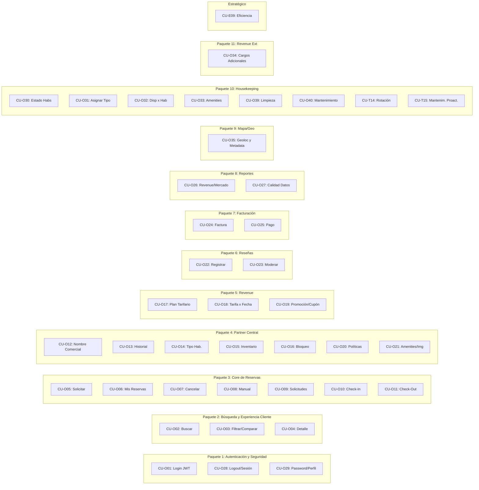

---

# 2. DIAGRAMA DE CLASES

El diagrama de clases modela el dominio central de HotelData con 32 clases que cubren los objetos del negocio: usuarios, hoteles, reservas, tarifas, reseñas, facturación, housekeeping y analítica. Se incluyen atributos clave, métodos principales y las relaciones de asociación, composición y herencia entre entidades.

## 2.1 Modelo de Dominio — Core del Sistema

```mermaid
classDiagram
  class User {
    +ObjectId _id
    +string email
    +string password_hash
    +bool is_active
    +string primary_role
    +object profile
    +datetime created_at
    +datetime updated_at
    +login()
    +logout()
    +changePassword()
    +updateProfile()
  }

  class UserSession {
    +ObjectId _id
    +string token_hash
    +ObjectId user_id
    +string role
    +datetime created_at
    +datetime expires_at
    +validate()
    +invalidate()
  }

  class Role {
    +ObjectId _id
    +string name
    +string description
    +list~string~ permissions
  }

  class Hotel {
    +ObjectId _id
    +int prop_id
    +string hotel_name
    +string destination
    +int stars
    +float rating
    +string address
    +object location
    +getDetail()
    +search()
  }

  class DimHotel {
    +ObjectId _id
    +int prop_id
    +string hotel_name
    +string destination
    +int stars
    +float review_score
    +float price_min
    +string main_image
    +int room_count
  }

  class RoomType {
    +ObjectId _id
    +int prop_id
    +string room_type_id
    +string name
    +int capacity_max
    +string description
    +list~string~ amenities
    +float base_price
    +create()
    +update()
  }

  class RoomInventoryCalendar {
    +ObjectId _id
    +int prop_id
    +string room_type_id
    +date date
    +int total_rooms
    +int booked_rooms
    +int blocked_rooms
    +int available_rooms
    +updateInventory()
    +blockAvailability()
  }

  class BookingOrder {
    +ObjectId _id
    +string booking_id
    +ObjectId user_id
    +int prop_id
    +string room_type_id
    +date check_in
    +date check_out
    +int adults
    +int children
    +float total
    +string status
    +datetime created_at
    +create()
    +cancel()
    +checkIn()
    +checkOut()
  }

  class BookingGuest {
    +ObjectId _id
    +string booking_id
    +string full_name
    +string email
    +string phone
  }

  class BookingStatusHistory {
    +ObjectId _id
    +string booking_id
    +string status
    +string reason
    +datetime timestamp
    +ObjectId changed_by
  }

  class RatePlan {
    +ObjectId _id
    +string name
    +string description
    +string cancellation_policy
    +create()
  }

  class HotelRateCalendar {
    +ObjectId _id
    +int prop_id
    +string room_type_id
    +string rate_plan_id
    +date date
    +float price
    +setRate()
  }

  class Promotion {
    +ObjectId _id
    +string name
    +float discount_percent
    +date valid_from
    +date valid_to
    +list~int~ prop_ids
  }

  class Coupon {
    +ObjectId _id
    +string code
    +ObjectId promotion_id
    +float discount
    +bool is_active
  }

  class Review {
    +ObjectId _id
    +int prop_id
    +ObjectId user_id
    +string booking_id
    +int rating
    +string comment
    +string status
    +object hotel_response
    +datetime created_at
    +create()
    +moderate()
    +respond()
  }

  class HotelPolicy {
    +ObjectId _id
    +int prop_id
    +string cancellation_policy
    +string check_in_time
    +string check_out_time
    +bool pets_allowed
    +float pet_fee
    +bool children_allowed
  }

  class HotelContentPage {
    +ObjectId _id
    +int prop_id
    +string description
    +list~string~ highlights
    +list~string~ amenities
    +string language
  }

  class HotelImage {
    +ObjectId _id
    +int prop_id
    +string image_base64
    +string caption
    +int sort_order
  }

  class BillingInvoice {
    +ObjectId _id
    +string booking_id
    +string rfc
    +string business_name
    +float total
    +string folio
    +datetime created_at
    +generate()
  }

  class BillingPayment {
    +ObjectId _id
    +string booking_id
    +float amount
    +string method
    +string reference
    +datetime created_at
  }

  class UserActivityLog {
    +ObjectId _id
    +ObjectId user_id
    +string email
    +string action_type
    +object details
    +datetime timestamp
  }

  class HotelEditHistory {
    +ObjectId _id
    +int prop_id
    +string field
    +string old_value
    +string new_value
    +ObjectId changed_by
    +datetime timestamp
  }

  class DataQualityReport {
    +ObjectId _id
    +int total_records
    +float rejection_rate
    +object quality_metrics
    +datetime generated_at
  }

  class RejectedRecord {
    +ObjectId _id
    +object original_record
    +string failed_rule
    +datetime timestamp
    +string suggested_action
  }

  class EtlExecution {
    +ObjectId _id
    +string status
    +datetime start_time
    +datetime end_time
    +int records_processed
    +string result
  }

  class HotelRoom {
    +ObjectId _id
    +int prop_id
    +string room_number
    +int floor
    +string room_type_id
    +string status
    +object maintenance_dates
    +getStatus()
    +assignRoomType()
  }

  class RoomStatusLog {
    +ObjectId _id
    +string room_id
    +string status
    +string action
    +datetime timestamp
    +string assigned_to
    +float rotation_time_minutes
    +logStatus()
  }

  class HousekeepingTask {
    +ObjectId _id
    +string room_id
    +string task_type
    +string status
    +string assigned_to
    +datetime created_at
    +datetime completed_at
    +assign()
    +complete()
  }

  class MaintenanceSchedule {
    +ObjectId _id
    +string room_id
    +string maintenance_type
    +string description
    +string priority
    +date scheduled_date
    +string status
    +bool is_recurring
    +string recurrence
    +schedule()
    +execute()
  }

  class MaintenanceTask {
    +ObjectId _id
    +ObjectId schedule_id
    +string room_id
    +string task_type
    +string status
    +string observations
    +datetime started_at
    +datetime completed_at
  }

  class AdditionalCharge {
    +ObjectId _id
    +string booking_id
    +string charge_type
    +string description
    +float amount
    +ObjectId created_by
    +datetime timestamp
  }

  class Destination {
    +ObjectId _id
    +string destination_id
    +string visible_name
    +float latitude
    +float longitude
    +string country
    +string city
    +string description
    +editMetadata()
  }

  class DimHotel {
    +bool name_is_manual_override
    +string original_name
    +overrideName()
  }

  class FactHotelReservation {
    +ObjectId _id
    +int prop_id
    +string destination
    +date event_date
    +float revenue
    +int room_nights
    +string channel
  }

  %% Relationships
  User "1" --> "*" UserSession : tiene
  User "1" --> "*" UserActivityLog : genera
  User "1" --> "*" BookingOrder : realiza
  User "1" --> "*" Review : escribe
  Role "1" --> "*" User : asigna
  BookingOrder "1" --> "*" BookingGuest : incluye
  BookingOrder "1" --> "*" BookingStatusHistory : registra
  BookingOrder "1" --> "1" BillingInvoice : genera
  BookingOrder "1" --> "*" BillingPayment : recibe
  Hotel "1" --> "*" RoomType : tiene
  Hotel "1" --> "*" RoomInventoryCalendar : posee
  Hotel "1" --> "1" HotelPolicy : define
  Hotel "1" --> "*" HotelContentPage : contiene
  Hotel "1" --> "*" HotelImage : muestra
  Hotel "1" --> "*" HotelEditHistory : audita
  Hotel "1" --> "*" Review : recibe
  Hotel "1" --> "*" RatePlan : oferta
  RoomType "1" --> "*" RoomInventoryCalendar : inventario
  RoomType "1" --> "*" HotelRateCalendar : tarifa
  RatePlan "1" --> "*" HotelRateCalendar : aplica
  Promotion "1" --> "*" Coupon : genera
  Promotion "*" --> "*" Hotel : promociona
  Hotel "*" --> "1" DimHotel : alimenta
  BookingOrder "*" --> "1" FactHotelReservation : alimenta
  Hotel "1" --> "*" HotelRoom : contiene
  HotelRoom "1" --> "*" RoomStatusLog : registra estado
  HotelRoom "1" --> "*" HousekeepingTask : asigna limpieza
  HotelRoom "1" --> "*" MaintenanceSchedule : programa
  MaintenanceSchedule "1" --> "*" MaintenanceTask : ejecuta
  BookingOrder "1" --> "*" AdditionalCharge : tiene cargos
  Destination "1" --> "*" Hotel : agrupa
  RoomType "1" --> "*" HotelRoom : clasifica
```

---

# 3. DIAGRAMA DE COMPONENTES

La arquitectura de HotelData sigue un modelo por capas: presentación (Angular 19 con 11 módulos funcionales), servicios (FastAPI con 10 servicios de negocio más seguridad), datos (MongoDB + Redis) e infraestructura (Docker + Airflow). Los dos diagramas siguientes muestran la organización de paquetes y las dependencias entre módulos.

## 3.1 Arquitectura de Paquetes del Sistema

```mermaid
graph TB
  subgraph "Capa de Presentación (Angular 19)"
    A[Auth Module<br/>login/logout/register]
    B[Hotel Search Module<br/>search/filter/compare/detail]
    C[Reservation Module<br/>create/list/cancel/checkin/checkout]
    D[Partner Module<br/>rooms/rates/content/policies]
    E[Revenue Module<br/>rateplans/promotions]
    F[Review Module<br/>create/moderate]
    G[Billing Module<br/>invoices/payments]
    H[Report Module<br/>revenue/quality]
    I[Admin Module<br/>users/roles/audit]
    J[Map Module<br/>world-map/location-picker]
    K[Housekeeping Module<br/>room-status/cleaning/maintenance]
  end

  subgraph "Capa de Servicios (FastAPI)"
    L[Auth Service<br/>auth/routes.py]
    M[Hotel Service<br/>hotels/service/]
    N[Reservation Service<br/>reservations/service/]
    O[Partner Service<br/>partner/services/]
    P[Revenue Service<br/>revenue/services/]
    Q[Review Service<br/>reviews/service/]
    R[Billing Service<br/>billing/service/]
    S[Admin Service<br/>admin/service/]
    T[Audit Service<br/>audit/]
    U[Map Service<br/>map/routes.py, geo_service.py]
    V[Housekeeping Service<br/>housekeeping/]
  end

  subgraph "Capa de Seguridad"
    W[Security Module<br/>session.py, jwt.py]
    X[Dependencies<br/>dependencies.py]
    Y[Navigation<br/>navigation.py]
  end

  subgraph "Capa de Datos"
    Z[(MongoDB<br/>hoteldata_hub)]
    AA[(Redis<br/>Cache/Session)]
  end

  subgraph "Capa de Infraestructura"
    AB[Docker Compose<br/>6 servicios]
    AC[Airflow<br/>ETL Pipeline]
  end

  A --> L
  B --> M
  C --> N
  D --> O
  E --> P
  F --> Q
  G --> R
  H --> S & T
  I --> S & T
  J --> U
  K --> V

  L --> W & X & Y
  M --> W & X
  N --> W & X
  O --> W & X
  P --> W & X
  Q --> W & X
  R --> W & X
  S --> W & X
  T --> W & X
  U --> W & X
  V --> W & X

  L --> Z & AA
  M --> Z
  N --> Z
  O --> Z
  P --> Z
  Q --> Z
  R --> Z
  S --> Z
  T --> Z
  U --> Z
  V --> Z
  Q --> V
  R --> V

  AC --> Z
```

## 3.2 Diagrama de Dependencias entre Módulos

Este diagrama complementa al anterior mostrando las relaciones de dependencia directa entre los módulos del backend. Los módulos base (`auth/`, `security/`) son el fundamento del que dependen todos los módulos de negocio y transversales.

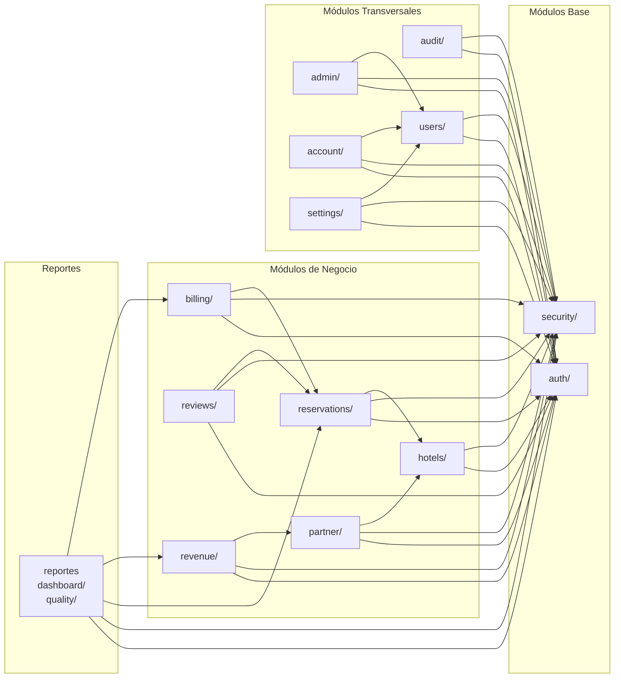

---

# 4. DIAGRAMA DE DESPLIEGUE

El sistema se despliega sobre Docker con 6 servicios orquestados: MongoDB 7.0, Redis 7.4, PocketBase, FastAPI (Uvicorn), Airflow y un frontend Angular servido por Nginx. Todos los servicios se comunican a través de la red `hoteldata-network` y persisten datos mediante volúmenes Docker.

## 4.1 Infraestructura Dockerizada

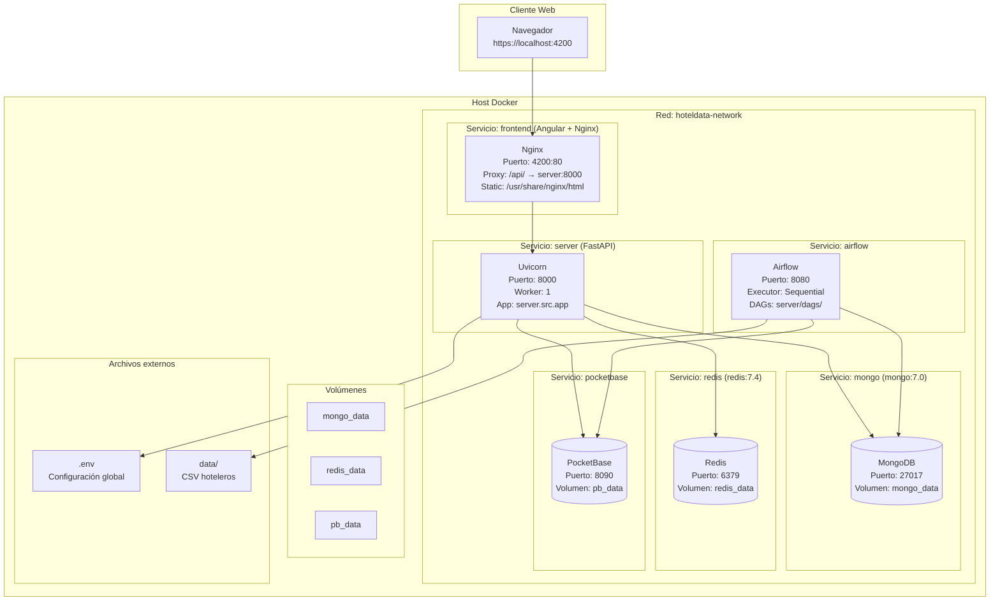

## 4.2 Diagrama de Red y Puertos

Se exponen 6 puertos al host: 4200 (frontend Angular/Nginx), 8000 (API FastAPI), 27017 (MongoDB), 6379 (Redis), 8090 (PocketBase) y 8080 (Airflow). Nginx actúa como proxy inverso redirigiendo `/api/`, `/auth/` y `/static/` hacia FastAPI.

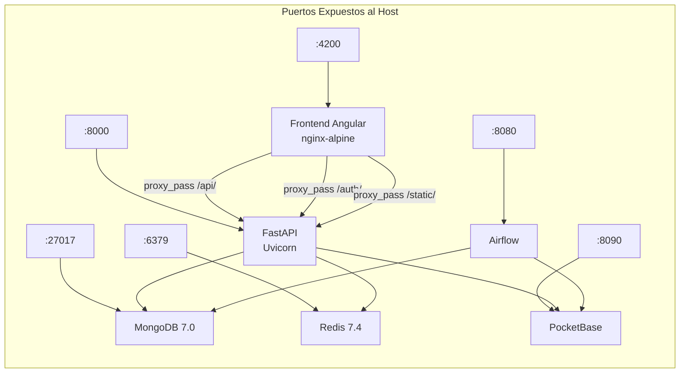

---

# 5. DIAGRAMA DE BASE DE DATOS

HotelData utiliza MongoDB como base de datos principal con un modelo documental que combina colecciones operacionales y analíticas en esquema Fact-Dim. El diagrama entidad-relación siguiente muestra las 25 colecciones principales y sus relaciones de uno a muchos.

## 5.1 Modelo Relacional de Colecciones MongoDB

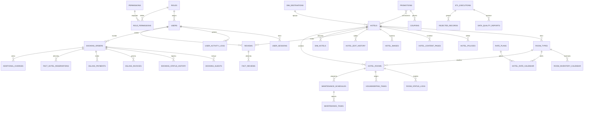

## 5.2 Colecciones por Módulo

Las 59 colecciones de MongoDB se distribuyen en 11 módulos funcionales, desde autenticación (6 colecciones) hasta housekeeping (6 colecciones). El módulo Partner es el más extenso con 13 colecciones, reflejando la complejidad de la gestión hotelera.

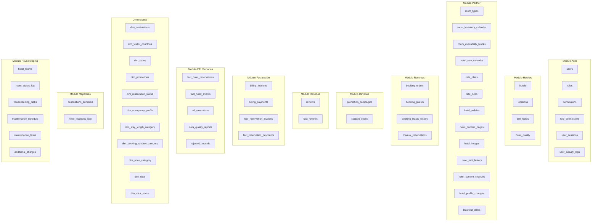

---

# 6. DIAGRAMA DE FLUJO DE DATOS

Los diagramas de flujo de datos documentan dos procesos críticos del sistema: el ciclo de vida de una reserva (desde solicitud hasta facturación) y el pipeline ETL que transforma datos CSV en el modelo analítico Fact-Dim.

## 6.1 Ciclo de Vida de una Reserva

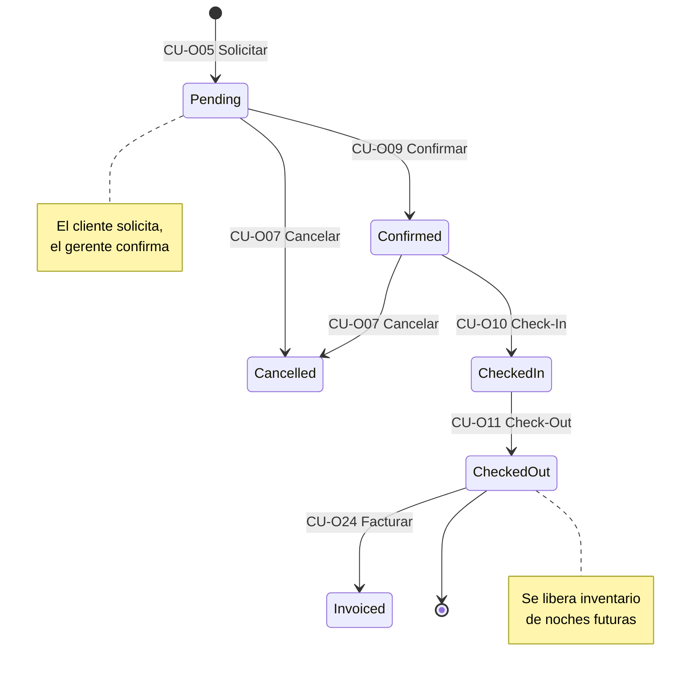

## 6.2 Flujo de Datos del Pipeline ETL

El pipeline ETL orquestado por Airflow procesa archivos CSV con 600 000 registros hoteleros. Cada registro pasa por validación de calidad: los aprobados se cargan en MongoDB y alimentan las tablas de hechos y dimensiones, mientras que los rechazados se almacenan con trazabilidad para su revisión.

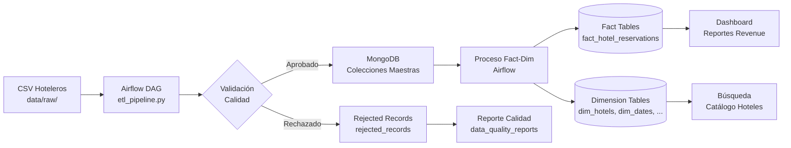

---

# 7. DIAGRAMA DE NAVEGACIÓN (FRONTEND ANGULAR)

La navegación del frontend Angular está segmentada por rol de usuario. Cada uno de los 7 perfiles (cliente, gerente, partner, revenue manager, marketing, admin, housekeeping y data operator) tiene acceso a rutas específicas que reflejan sus responsabilidades dentro del sistema.

## 7.1 Mapa de Navegación por Rol

```mermaid
graph TB
  subgraph "Público / No autenticado"
    L[/auth/login]
  end

  subgraph "Cliente"
    H[/hotels/search<br/>Buscar]
    HD[/hotels/id<br/>Detalle]
    HC[/hotels/compare<br/>Comparar]
    R[/reservations<br/>Mis Reservas]
    RN[/reservations/new<br/>Nueva Reserva]
    RD[/reservations/id<br/>Detalle Reserva]
    A[/account/profile<br/>Mi Perfil]
    RV[/reviews/new<br/>Reseñar]
  end

  subgraph "Gerente de Hotel"
    RS[/reservations/requests<br/>Solicitudes]
    RI[/reservations/id/checkin<br/>Check-In]
    RO[/reservations/id/checkout<br/>Check-Out]
    BI[/billing/invoices<br/>Facturación]
    D[/dashboard<br/>Dashboard]
  end

  subgraph "Hotel Partner"
    P[/partner/properties<br/>Mis Propiedades]
    PR[/partner/rooms<br/>Habitaciones]
    PT[/partner/rates<br/>Tarifas]
    PC[/partner/content<br/>Contenido]
    PP[/partner/policies<br/>Políticas]
  end

  subgraph "Revenue Manager"
    V[/revenue/rateplans<br/>Planes Tarifarios]
    VC[/revenue/calendar<br/>Calendario Tarifas]
    VP[/revenue/promotions<br/>Promociones]
    VR[/revenue/reports<br/>Reportes Revenue]
  end

  subgraph "Marketing"
    M[/partner/content<br/>Contenido Hotel]
    MI[/partner/images<br/>Imágenes]
    MR[/reviews/moderate<br/>Moderar Reseñas]
  end

  subgraph "Admin / Sistema"
    SU[/system-admin/users<br/>Usuarios]
    SR[/system-admin/roles<br/>Roles]
    SA[/system-admin/audit<br/>Auditoría]
  end

  subgraph "Housekeeping / Operaciones"
    HS[/housekeeping/rooms/status<br/>Estado Habitaciones]
    HC[/housekeeping/cleaning/pending<br/>Limpieza Pendiente]
    HM[/housekeeping/maintenance<br/>Mantenimiento]
  end

  subgraph "Mapa / Datos"
    MW[/map/world<br/>Mapa Mundial]
    DE[/admin/destinations<br/>Editar Destinos]
    HO[/admin/hotels/override<br/>Override Hoteles]
  end

  subgraph "Data Operator"
    Q[/quality<br/>Calidad Datos]
    QE[/quality/etl<br/>Ejecuciones ETL]
  end

  L --> H
  H --> HD & HC
  HD --> RN
  RN --> R
  R --> RD & RV
  RD --> RI & RO & BI
  A --> L

  RS --> RI
  RI --> RO
  RO --> BI

  PR --> PT
  PC --> MI

  VC --> VR
  VP --> VR

  MR --> HD

  SA --> SR & SU
  SU --> DE & HO & MW
  Q --> HS & HC & HM
  HS --> HC
  HC --> HM
```

---

# 8. DIAGRAMA DE PROCESOS DE NEGOCIO

Este diagrama integra los procesos de los 5 departamentos principales en un flujo único: desde la búsqueda del cliente hasta la facturación y limpieza post-estancia. Se muestran las interacciones entre cliente, gerente de hotel, revenue manager, marketing y housekeeping.

## 8.1 Proceso de Reserva Completo (BPMN simplificado)

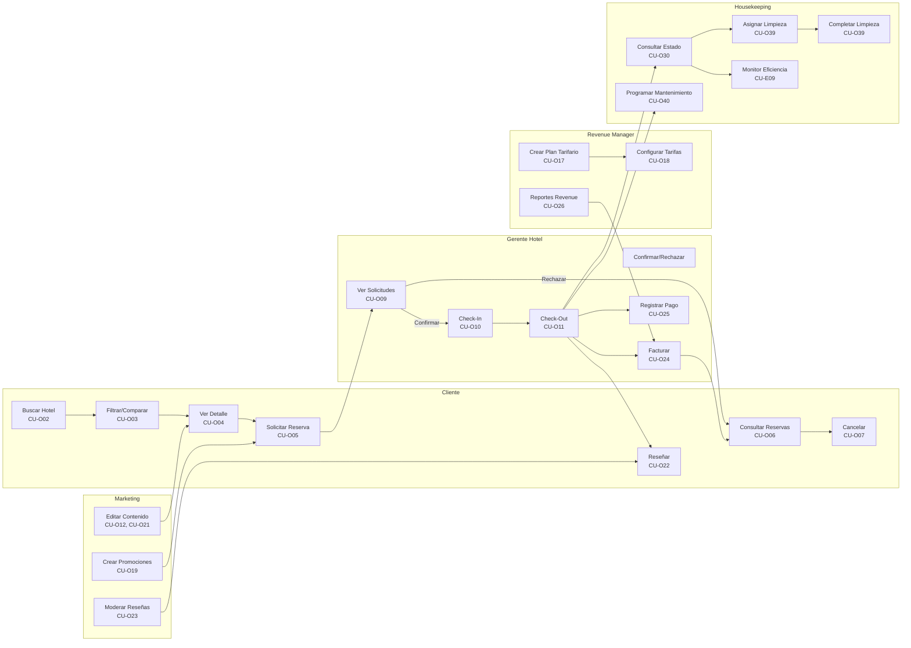

---

*Fin del documento TA07_UML.md — 8 secciones de diagramas UML: Casos de Uso, Clases, Componentes, Despliegue, Base de Datos, Flujo de Datos, Navegación y Procesos de Negocio.*
